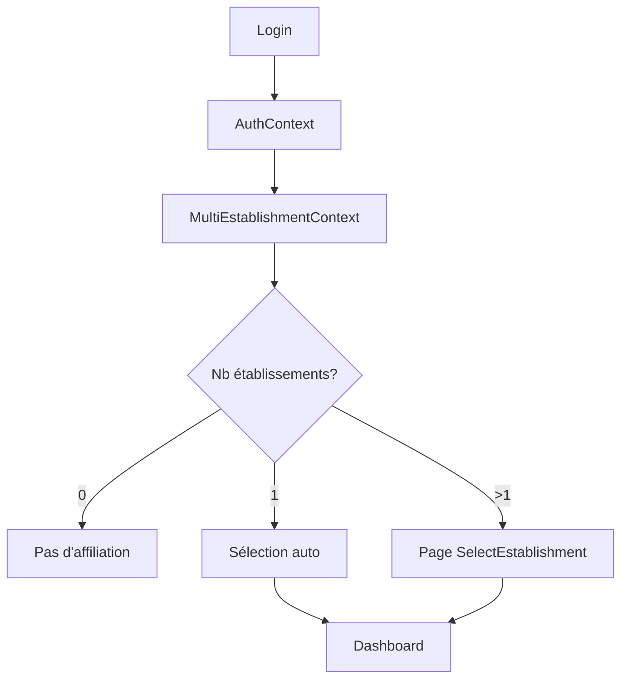
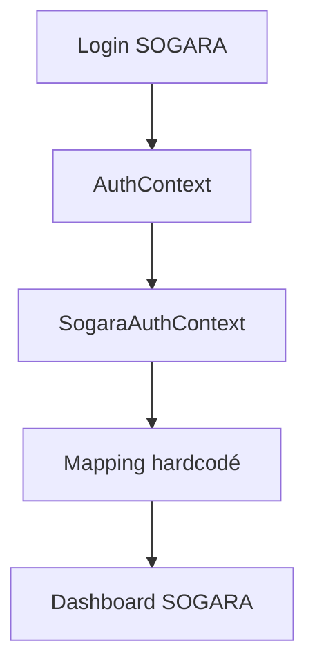
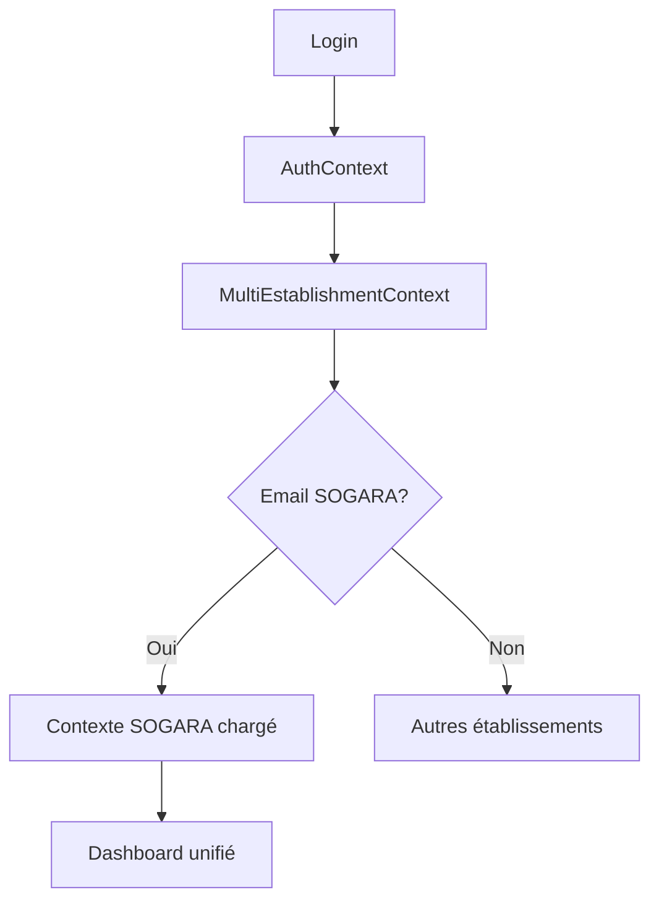

# 🔍 ANALYSE DE CONFORMITÉ - Architecture SANTE.GA

**Date**: 30 octobre 2025  
**Analysé par**: AI Lovable  
**Référence**: RAPPORT_ARCHITECTURE_COMPLETE.md

---

## 📊 RÉSUMÉ EXÉCUTIF

### Score Global de Conformité: **65%** 🟡

| Composant | Conformité | Note |
|-----------|-----------|------|
| AuthContext (Base) | ✅ Conforme | 95% |
| MultiEstablishmentContext | 🟡 Partiellement | 70% |
| SogaraAuthContext | ❌ Non conforme | 30% |
| Base de données | 🟡 Partiellement | 60% |
| Flux de connexion | 🟡 Partiellement | 65% |

**Statut**: Système fonctionnel mais nécessite une refonte pour être pleinement conforme à l'architecture cible.

---

## 1. ANALYSE DES CONTEXTES D'AUTHENTIFICATION

### ✅ 1.1 AuthContext (Base) - **CONFORME 95%**

**Ce qui fonctionne bien:**
```typescript
// src/contexts/AuthContext.tsx
interface AuthContextType {
  user: User | null;              ✅ Supabase User
  session: Session | null;        ✅ Session complète
  userRoles: AppRole[];           ✅ Rôles globaux
  hasRole: (role) => boolean;     ✅ Vérification rôles
  hasAnyRole: (roles) => boolean; ✅ Vérification multiple
  signIn, signUp, signOut         ✅ Méthodes d'auth
}
```

**Alignement avec le document:**
- ✅ Gestion Supabase correcte
- ✅ Session + User stockés
- ✅ Rôles globaux via `user_roles`
- ✅ onAuthStateChange correctement implémenté
- ✅ emailRedirectTo configuré

**Recommandations mineures:**
- Ajouter `userType: 'patient' | 'professional' | 'establishment' | 'admin'`
- Cacher les détails d'implémentation Supabase dans les messages d'erreur

---

### 🟡 1.2 MultiEstablishmentContext - **PARTIELLEMENT CONFORME 70%**

**Ce qui fonctionne:**
```typescript
// src/contexts/MultiEstablishmentContext.tsx
✅ Charge les établissements depuis establishment_staff
✅ Sélection d'établissement
✅ Switch entre établissements
✅ Helpers: isAdmin, isDirector, canManageStaff
✅ hasPermission() pour vérifier les droits
```

**Divergences détectées:**

#### 🔴 Problème 1: Structure des données
```typescript
// ❌ ACTUEL
interface StaffRole {
  role: string;  // Utilise 'role_in_establishment' en DB
  permissions: string[]; // Type ARRAY en DB
  // Manque: department, position, matricule
}

// ✅ ATTENDU (selon doc)
interface EstablishmentStaff {
  role: string;
  department?: string;      // ❌ Manquant
  position?: string;        // ❌ Manquant
  matricule?: string;       // ❌ Manquant
  permissions: Permission[]; // ✅ OK
  is_establishment_admin: boolean; // ❌ Utilise is_admin
}
```

#### 🔴 Problème 2: Récupération des données
```typescript
// ❌ ACTUEL: Fait 2 requêtes séparées
const { data: professional } = await supabase
  .from('professionals')
  .select('id')
  .eq('user_id', user.id);

const { data: staffRoles } = await supabase
  .from('establishment_staff')
  .select('...')
  .eq('professional_id', professional.id);

// ✅ ATTENDU: Devrait utiliser une seule requête avec JOIN
// Ou mieux: utiliser une fonction RPC
```

#### 🔴 Problème 3: Permissions
```typescript
// ❌ ACTUEL: Permissions en array simple
permissions: string[]

// ✅ ATTENDU: Permissions typées
permissions: Permission[] // avec enum défini
```

**Recommandations:**
1. Ajouter les champs manquants dans `StaffRole` interface
2. Créer une fonction RPC pour récupérer les établissements (performance)
3. Typer les permissions avec un enum
4. Utiliser `is_establishment_admin` au lieu de `is_admin`

---

### ❌ 1.3 SogaraAuthContext - **NON CONFORME 30%**

**Problème majeur: Données hardcodées**

```typescript
// ❌ ACTUEL: Mapping hardcodé dans le code
const SOGARA_USERS: Record<string, Omit<SogaraUser, 'id' | 'email'>> = {
  'directeur.sogara@sante.ga': {
    fullName: 'Dr. Jules DJEKI',
    role: 'director',
    department: 'Direction Médicale',
    matricule: 'DIR-001',
    permissions: ['all']
  },
  // ... 10+ autres utilisateurs hardcodés
};

// ⚠️ PROBLÈMES:
// 1. Données en dur (pas synchronisées avec la DB)
// 2. Impossible de mettre à jour sans redéployer
// 3. Duplication avec establishment_staff
// 4. Pas de multi-établissements possible
```

**Architecture attendue:**
```typescript
// ✅ ATTENDU: Utiliser MultiEstablishmentContext
export function SogaraAuthProvider({ children }: { children: ReactNode }) {
  const { currentEstablishment } = useMultiEstablishment();
  
  // Pas de mapping hardcodé !
  // Tout vient de la DB via MultiEstablishmentContext
  
  const isSogaraContext = currentEstablishment?.establishment.id === 'sogara-001';
  const isSogaraUser = user?.email?.includes('.sogara@');
  
  // Simplement un wrapper pour faciliter l'usage SOGARA
}
```

**Verdict:**
🚨 **À REFACTORISER COMPLÈTEMENT**  
SogaraAuthContext devrait être un **wrapper léger** autour de MultiEstablishmentContext, pas une source de données indépendante.

---

## 2. ANALYSE DE LA BASE DE DONNÉES

### 🔴 2.1 Duplication: `professionals` vs `professional_profiles`

**Problème majeur détecté:**

```sql
-- ❌ ACTUEL: 2 tables pour les professionnels

TABLE professionals (
  id UUID,
  user_id UUID,
  full_name TEXT,
  email TEXT,
  phone TEXT,
  license_number TEXT,
  speciality TEXT,
  professional_type ENUM, -- medecin_generaliste, etc.
  status ENUM, -- actif, suspendu, etc.
  verified BOOLEAN
)

TABLE professional_profiles (
  id UUID,
  user_id UUID,
  profession_type TEXT, -- 'doctor', 'nurse', etc.
  specialization TEXT,
  ordre_number TEXT,
  ordre_verified BOOLEAN,
  bio TEXT
)

-- ⚠️ DUPLICATION:
-- - user_id dans les deux
-- - profession_type vs professional_type
-- - ordre_number vs license_number
-- - Vérification dupliquée (verified vs ordre_verified)
```

**Impact sur `establishment_staff`:**
```sql
-- ❌ ACTUEL: Référence professional_profiles
establishment_staff.professional_id → professional_profiles.id

-- ❌ PROBLÈME: On a besoin des données dans professionals
-- (full_name, email, phone, speciality)
-- Mais establishment_staff ne peut pas y accéder directement !
```

**Solution attendue (selon doc):**
```sql
-- ✅ ATTENDU: Une seule table professionnels
TABLE professionals (
  id UUID PRIMARY KEY,
  user_id UUID REFERENCES auth.users(id),
  full_name TEXT NOT NULL,
  email TEXT UNIQUE NOT NULL,
  phone TEXT,
  speciality TEXT,
  license_number TEXT,
  professional_type TEXT, -- 'doctor', 'nurse', 'pharmacist'
  is_verified BOOLEAN DEFAULT false,
  verification_date TIMESTAMPTZ,
  
  -- Métadonnées professionnelles
  diplomas JSONB,
  years_experience INTEGER,
  bio TEXT,
  
  created_at TIMESTAMPTZ DEFAULT NOW(),
  updated_at TIMESTAMPTZ DEFAULT NOW()
);

-- establishment_staff référence directement professionals
establishment_staff.professional_id → professionals.id
```

**Recommandation:**
🚨 **ACTION CRITIQUE**: Fusionner les deux tables ou clarifier leur usage distinct.

---

### 🟡 2.2 Structure de `establishment_staff` - **DIVERGENCES**

**Comparaison structure:**

| Champ | Actuel | Attendu (doc) | Statut |
|-------|--------|---------------|--------|
| `id` | ✅ UUID | ✅ UUID | ✅ OK |
| `establishment_id` | ✅ UUID | ✅ UUID | ✅ OK |
| `professional_id` | ✅ UUID → professional_profiles | ⚠️ UUID → professionals | 🔴 Divergence |
| `role_in_establishment` | ✅ TEXT | ✅ role TEXT | 🟡 Nom différent |
| `is_admin` | ✅ BOOLEAN | ⚠️ is_establishment_admin | 🔴 Nom différent |
| `permissions` | ✅ TEXT[] | ✅ JSONB | 🟡 Type différent |
| `schedule` | ✅ JSONB | ✅ JSONB | ✅ OK |
| `status` | ✅ TEXT | ✅ TEXT | ✅ OK |
| `start_date` | ✅ DATE | ✅ DATE | ✅ OK |
| `end_date` | ✅ DATE | ✅ DATE | ✅ OK |
| `department_id` | ❌ Manquant | ✅ UUID → departments | 🔴 Manquant |
| `position` | ❌ Manquant | ✅ TEXT | 🔴 Manquant |
| `is_department_head` | ❌ Manquant | ✅ BOOLEAN | 🔴 Manquant |
| `matricule` | ❌ Manquant | ✅ TEXT | 🔴 Manquant |
| `office_location` | ❌ Manquant | ✅ TEXT | 🔴 Manquant |
| `office_phone` | ❌ Manquant | ✅ TEXT | 🔴 Manquant |
| `employment_type` | ❌ Manquant | ✅ TEXT | 🔴 Manquant |

**Verdict:**
🟡 **Structure de base OK** mais **manque plusieurs champs** importants pour la granularité des rôles.

---

### 🟡 2.3 Table `establishment_departments`

**État actuel:**
```sql
-- ✅ Table existe
establishment_departments (
  id TEXT PRIMARY KEY,  -- ⚠️ TEXT au lieu de UUID
  establishment_id UUID,
  name TEXT,
  code TEXT,
  description TEXT
)
```

**Divergences:**
- 🔴 `id` est TEXT au lieu de UUID (incohérent avec autres tables)
- ❌ Pas de référence dans `establishment_staff.department_id`

**Recommandation:**
- Migrer `id` de TEXT vers UUID
- Ajouter `department_id` dans `establishment_staff`

---

## 3. ANALYSE DES FLUX

### 🟡 3.1 Flux de Connexion Professionnel

**Flux actuel:**


**Conformité avec le doc:**
- ✅ Sélection automatique si 1 seul établissement
- ✅ Page de sélection si plusieurs
- ✅ Switch entre établissements
- 🟡 Mais le chargement pourrait être optimisé

---

### ❌ 3.2 Flux SOGARA - **NON CONFORME**

**Flux actuel:**


**Flux attendu (selon doc):**


**Problèmes:**
1. 🔴 **Isolation**: SOGARA n'utilise pas le système multi-établissements
2. 🔴 **Duplication**: Données hardcodées au lieu de DB
3. 🔴 **Évolutivité**: Impossible d'ajouter un employé sans modifier le code

---

## 4. PROBLÈMES CRITIQUES IDENTIFIÉS

### 🔴 4.1 Duplication de Tables Professionnels

**Impact:**
- Confusion sur quelle table utiliser
- Queries complexes avec double JOIN
- Risque d'incohérence des données
- Performance dégradée

**Code affecté:**
```typescript
// ❌ MultiEstablishmentContext fait:
const { data: professional } = await supabase
  .from('professionals')
  .select('id')
  .eq('user_id', user.id);

// Puis:
const { data: staffRoles } = await supabase
  .from('establishment_staff')
  .select('...')
  .eq('professional_id', professional.id); // ❌ Mais référence professional_profiles !
```

**Solution:**
1. **Option A** (Recommandée): Fusionner en une seule table `professionals`
2. **Option B**: Clarifier l'usage:
   - `professionals`: Données médicales (ordre, licence)
   - `professional_profiles`: Données plateforme (bio, tarifs)
   - Ajouter `professional_id` dans `professional_profiles` → `professionals.id`

---

### 🔴 4.2 SogaraAuthContext Hardcodé

**Impact:**
- ⚠️ Impossible d'ajouter un employé SOGARA sans modifier le code
- ⚠️ Pas de multi-établissements pour employés SOGARA
- ⚠️ Pas de synchronisation avec la base de données
- ⚠️ Maintenance complexe (données dupliquées)

**Exemple du problème:**
```typescript
// ❌ ACTUEL: Si on ajoute un employé en DB, il n'apparaît pas !
const SOGARA_USERS: Record<string, ...> = {
  'directeur.sogara@sante.ga': { ... }, // Hardcodé
  // Pour ajouter quelqu'un, il faut:
  // 1. Modifier ce fichier
  // 2. Redéployer l'app
  // 3. Espérer qu'il n'y a pas d'erreur de typage
};

// ✅ ATTENDU: Tout dans la DB
// Ajouter un employé = INSERT dans establishment_staff
// Aucun code à modifier !
```

**Solution:**
```typescript
// Supprimer SogaraAuthContext
// Utiliser seulement MultiEstablishmentContext

// Pour identifier SOGARA:
const isSogaraContext = currentEstablishment?.establishment.id === 'sogara-id';
const isSogaraUser = user?.email?.includes('.sogara@');
```

---

### 🟡 4.3 Champs Manquants dans `establishment_staff`

**Champs critiques absents:**

| Champ | Importance | Impact si absent |
|-------|------------|------------------|
| `department_id` | 🔴 Haute | Impossible d'assigner à un département spécifique |
| `position` | 🟡 Moyenne | Pas de titre de poste (ex: "Chef de service") |
| `matricule` | 🟡 Moyenne | Pas d'identifiant interne établissement |
| `is_department_head` | 🟡 Moyenne | Impossible de gérer hiérarchie départements |
| `employment_type` | 🟢 Basse | Pas de distinction temps plein/partiel/vacataire |

**Exemple concret - Dr. DJEKI:**
```typescript
// ❌ ACTUEL: On ne peut pas représenter précisément
{
  role: 'director',
  // ❌ Pas de department_id
  // ❌ Pas de position ("Directeur Médical")
  // ❌ Pas de matricule (DIR-001)
}

// ✅ ATTENDU:
{
  role: 'director',
  department_id: 'dept-sogara-dir',
  position: 'Directeur Médical',
  matricule: 'DIR-001',
  is_department_head: true,
  is_establishment_admin: true
}
```

---

## 5. CONFORMITÉ PAR FONCTIONNALITÉ

### ✅ 5.1 Authentification de Base - **CONFORME**

| Fonctionnalité | Statut | Note |
|----------------|--------|------|
| Login email/password | ✅ | Fonctionne |
| Sign up | ✅ | Fonctionne |
| Session persistence | ✅ | Correct |
| Logout | ✅ | Correct |
| Role checking | ✅ | Correct |

---

### 🟡 5.2 Multi-Établissements - **PARTIELLEMENT CONFORME**

| Fonctionnalité | Statut | Notes |
|----------------|--------|-------|
| Charger établissements | 🟡 | Fonctionne mais inefficace (2 requêtes) |
| Sélection établissement | ✅ | OK |
| Switch établissement | ✅ | OK |
| Permissions par établissement | 🟡 | Basique, manque granularité |
| Départements | ❌ | Non géré |
| Multi-rôles (même établissement) | ❌ | Impossible actuellement |

**Exemple multi-rôles impossible:**
```typescript
// ❌ ACTUEL: Dr. DJEKI ne peut pas avoir 2 rôles SOGARA
// UNIQUE(establishment_id, professional_id)
// → 1 seul rôle par établissement !

// ✅ ATTENDU: Dr. DJEKI = Directeur + Médecin
// UNIQUE(establishment_id, professional_id, department_id)
// → Plusieurs rôles possibles si départements différents
```

---

### ❌ 5.3 SOGARA Spécifique - **NON CONFORME**

| Fonctionnalité | Statut | Notes |
|----------------|--------|-------|
| Données en DB | ❌ | Hardcodées dans le code |
| Multi-établissements SOGARA | ❌ | Pas possible |
| Ajout employés dynamique | ❌ | Nécessite modif code |
| Départements | ❌ | Hardcodés |
| Hiérarchie | ❌ | Simplifiée |

---

## 6. ANALYSE DES ROUTES ET PAGES

### ✅ 6.1 Structure Générale - **BONNE**

```
✅ /login/professional    → Login pro
✅ /professional/select   → Sélection établissement
✅ /professional/dashboard → Dashboard pro
✅ /establishments/:id/*  → Routes par établissement
✅ /establishments/sogara/* → Routes SOGARA spécifiques
```

**Commentaires:**
- Structure cohérente
- Séparation claire par type d'utilisateur
- Routes imbriquées logiques

---

### 🟡 6.2 Guards et Protections

```typescript
// ✅ EstablishmentGuard existe
// Vérifie qu'un établissement est sélectionné

// 🟡 Mais manque:
// - ProfessionalGuard (vérifier type utilisateur)
// - PermissionGuard (vérifier permissions spécifiques)
// - RoleGuard (vérifier rôle dans établissement)
```

---

## 7. RECOMMANDATIONS PAR PRIORITÉ

### 🔴 PRIORITÉ 1 - CRITIQUE (Semaine 1)

#### 1. Résoudre la duplication `professionals` / `professional_profiles`

**Option A - Fusion (Recommandée):**
```sql
-- Fusionner tout dans professionals
ALTER TABLE professionals ADD COLUMN IF NOT EXISTS bio TEXT;
ALTER TABLE professionals ADD COLUMN IF NOT EXISTS years_experience INTEGER;
ALTER TABLE professionals ADD COLUMN IF NOT EXISTS consultation_fee INTEGER;

-- Migrer les données
UPDATE professionals p
SET 
  bio = pp.bio,
  years_experience = pp.years_experience
FROM professional_profiles pp
WHERE p.user_id = pp.user_id;

-- Supprimer professional_profiles
DROP TABLE professional_profiles CASCADE;

-- Mettre à jour establishment_staff
ALTER TABLE establishment_staff 
  DROP CONSTRAINT establishment_staff_professional_id_fkey;
  
ALTER TABLE establishment_staff
  ADD CONSTRAINT establishment_staff_professional_id_fkey
  FOREIGN KEY (professional_id) REFERENCES professionals(id);
```

**Option B - Clarification:**
```sql
-- Garder les deux mais clarifier
-- professionals = Données médicales officielles
-- professional_profiles = Données plateforme

-- Ajouter lien
ALTER TABLE professional_profiles 
  ADD COLUMN professional_id UUID REFERENCES professionals(id);
```

#### 2. Supprimer le hardcoding dans SogaraAuthContext

**Étapes:**
1. Créer les données SOGARA dans `establishment_staff`
2. Modifier `SogaraAuthContext` pour utiliser `MultiEstablishmentContext`
3. Supprimer le dictionnaire `SOGARA_USERS`

**Code cible:**
```typescript
export function SogaraAuthProvider({ children }: { children: ReactNode }) {
  const { currentEstablishment, hasPermission } = useMultiEstablishment();
  
  // Simplement un wrapper pour faciliter l'usage
  const isSogaraContext = currentEstablishment?.establishmentId === 'a1b2c3d4-...';
  
  return (
    <SogaraAuthContext.Provider value={{
      user: currentEstablishment ? {
        id: currentEstablishment.id,
        fullName: /* depuis DB */,
        role: currentEstablishment.role,
        department: currentEstablishment.department,
        // ...
      } : null,
      isDirector: currentEstablishment?.role === 'director',
      hasPermission: (p) => hasPermission(p)
    }}>
      {children}
    </SogaraAuthContext.Provider>
  );
}
```

#### 3. Ajouter les champs manquants dans `establishment_staff`

```sql
-- Ajouter les champs critiques
ALTER TABLE establishment_staff 
  ADD COLUMN department_id UUID REFERENCES establishment_departments(id),
  ADD COLUMN position TEXT,
  ADD COLUMN matricule TEXT,
  ADD COLUMN is_department_head BOOLEAN DEFAULT false,
  ADD COLUMN employment_type TEXT DEFAULT 'full_time';

-- Renommer pour cohérence
ALTER TABLE establishment_staff 
  RENAME COLUMN is_admin TO is_establishment_admin;

-- Modifier la contrainte unique pour permettre multi-rôles
ALTER TABLE establishment_staff 
  DROP CONSTRAINT establishment_staff_establishment_id_professional_id_key;

ALTER TABLE establishment_staff
  ADD CONSTRAINT unique_staff_role 
  UNIQUE(establishment_id, professional_id, department_id);
```

---

### 🟡 PRIORITÉ 2 - IMPORTANTE (Semaine 2-3)

#### 4. Créer une fonction RPC optimisée

```sql
CREATE OR REPLACE FUNCTION get_user_establishments(p_user_id UUID)
RETURNS TABLE (
  staff_id UUID,
  establishment_id UUID,
  establishment_name TEXT,
  establishment_type TEXT,
  role TEXT,
  position TEXT,
  department_id UUID,
  department_name TEXT,
  matricule TEXT,
  permissions TEXT[],
  is_admin BOOLEAN,
  is_department_head BOOLEAN,
  status TEXT
) AS $$
BEGIN
  RETURN QUERY
  SELECT 
    es.id,
    e.id,
    e.raison_sociale,
    e.type_etablissement::TEXT,
    es.role_in_establishment,
    es.position,
    ed.id,
    ed.name,
    es.matricule,
    es.permissions,
    es.is_establishment_admin,
    es.is_department_head,
    es.status
  FROM establishment_staff es
  JOIN establishments e ON e.id = es.establishment_id
  JOIN professionals p ON p.id = es.professional_id
  LEFT JOIN establishment_departments ed ON ed.id = es.department_id
  WHERE p.user_id = p_user_id
    AND es.status = 'active'
    AND e.statut = 'actif'
  ORDER BY es.is_establishment_admin DESC, e.raison_sociale;
END;
$$ LANGUAGE plpgsql SECURITY DEFINER;
```

Puis dans le code:
```typescript
const { data } = await supabase.rpc('get_user_establishments', {
  p_user_id: user.id
});
// Une seule requête au lieu de 2+ !
```

#### 5. Typer les permissions

```typescript
// src/types/permissions.ts
export enum Permission {
  // Consultation
  VIEW_DMP = 'view_dmp',
  EDIT_DMP = 'edit_dmp',
  CONSULTATION = 'consultation',
  PRESCRIPTION = 'prescription',
  
  // Examens
  ORDER_LAB_TEST = 'order_lab_test',
  VIEW_LAB_RESULTS = 'view_lab_results',
  
  // Admin
  MANAGE_STAFF = 'manage_staff',
  MANAGE_APPOINTMENTS = 'manage_appointments',
  VIEW_ANALYTICS = 'view_analytics',
  
  // Urgences
  EMERGENCY_ACCESS = 'emergency_access',
  TRIAGE = 'triage',
  
  // Pharmacie
  DISPENSE_MEDICATION = 'dispense_medication',
  MANAGE_STOCK = 'manage_stock'
}

// Usage
hasPermission(Permission.PRESCRIPTION)
// Au lieu de
hasPermission('prescription') // ❌ Typo possible
```

#### 6. Créer les Guards manquants

```typescript
// src/components/auth/ProfessionalGuard.tsx
export function ProfessionalGuard({ children }) {
  const { userRoles } = useAuth();
  const { establishments, loading } = useMultiEstablishment();
  
  if (loading) return <Loader />;
  
  if (!userRoles.includes('professional') || establishments.length === 0) {
    return <Navigate to="/access-denied" />;
  }
  
  return <>{children}</>;
}

// src/components/auth/PermissionGuard.tsx
export function PermissionGuard({ 
  permission, 
  children, 
  fallback 
}: {
  permission: Permission;
  children: ReactNode;
  fallback?: ReactNode;
}) {
  const { hasPermission } = useMultiEstablishment();
  
  if (!hasPermission(permission)) {
    return <>{fallback || null}</>;
  }
  
  return <>{children}</>;
}
```

---

### 🟢 PRIORITÉ 3 - AMÉLIORATIONS (Mois 2+)

#### 7. Unifier les contextes

**Plan:**
1. Supprimer `OfflineAuthContext` (démo seulement)
2. Refactoriser `SogaraAuthContext` comme wrapper léger
3. Tout passer par `MultiEstablishmentContext`

**Résultat:**
```typescript
// Un seul flux pour TOUS les professionnels
// Que ce soit SOGARA, CHU, ou Clinique privée
```

#### 8. Implémenter les permissions granulaires

**Actuellement:**
```typescript
// ❌ Simple: liste de strings
permissions: ['consultation', 'prescription']
```

**Cible:**
```typescript
// ✅ Granulaire: objets avec actions
permissions: {
  dmp: ['view', 'edit'],
  prescriptions: ['create', 'view', 'cancel'],
  appointments: ['view', 'manage']
}
```

#### 9. Ajouter l'historique de contexte

```sql
CREATE TABLE user_establishment_history (
  id UUID PRIMARY KEY,
  user_id UUID,
  establishment_id UUID,
  role TEXT,
  action TEXT, -- 'login', 'switch', 'logout'
  timestamp TIMESTAMPTZ DEFAULT NOW()
);
```

---

## 8. PLAN D'ACTION DÉTAILLÉ

### 🎯 Phase 1: Corrections Critiques (Semaine 1)

**Jour 1-2:**
- [ ] Résoudre duplication professionals/professional_profiles
- [ ] Décider: Fusionner ou clarifier usage
- [ ] Migrer les données si fusion

**Jour 3-4:**
- [ ] Ajouter champs manquants dans establishment_staff
  - department_id
  - position
  - matricule
  - is_department_head
- [ ] Modifier contrainte unique pour multi-rôles

**Jour 5:**
- [ ] Migrer les données SOGARA hardcodées vers la DB
- [ ] Créer les enregistrements establishment_staff pour SOGARA
- [ ] Tester que MultiEstablishmentContext charge bien les données SOGARA

---

### 🎯 Phase 2: Refactoring (Semaine 2-3)

**Semaine 2:**
- [ ] Créer fonction RPC `get_user_establishments`
- [ ] Modifier MultiEstablishmentContext pour utiliser la RPC
- [ ] Refactoriser SogaraAuthContext (wrapper léger)
- [ ] Créer enum Permission

**Semaine 3:**
- [ ] Créer ProfessionalGuard
- [ ] Créer PermissionGuard
- [ ] Mettre à jour toutes les routes protégées
- [ ] Tests de régression

---

### 🎯 Phase 3: Optimisations (Semaine 4+)

**Semaine 4:**
- [ ] Supprimer OfflineAuthContext
- [ ] Unifier tous les flux professionnels
- [ ] Documentation mise à jour

**Semaine 5+:**
- [ ] Permissions granulaires (objets au lieu de strings)
- [ ] Historique de contexte
- [ ] Analytics par établissement

---

## 9. IMPACTS ET RISQUES

### 🔴 Risques Actuels (Sans Corrections)

| Risque | Impact | Probabilité | Sévérité |
|--------|--------|-------------|----------|
| **Duplication de données** | Incohérences | Haute | 🔴 Haute |
| **SOGARA isolé** | Impossible de scaler | Haute | 🔴 Haute |
| **Pas de multi-rôles** | Limite fonctionnalités | Moyenne | 🟡 Moyenne |
| **Permissions simplistes** | Sécurité faible | Moyenne | 🔴 Haute |
| **Queries inefficaces** | Performance | Basse | 🟡 Moyenne |

### ✅ Bénéfices Corrections

| Bénéfice | Impact |
|----------|--------|
| **Cohérence des données** | 🟢 Haute |
| **Scalabilité SOGARA** | 🟢 Haute |
| **Flexibilité rôles** | 🟢 Haute |
| **Performance** | 🟡 Moyenne |
| **Maintenance** | 🟢 Haute |

---

## 10. COMPARAISON DÉTAILLÉE

### Architecture Actuelle vs Cible

```
ACTUEL:
┌─────────────┐
│ AuthContext │ (Base)
└──────┬──────┘
       │
   ┌───┴────────────────────┐
   │                        │
   │                        │
┌──▼────────────────┐  ┌───▼──────────────┐
│MultiEstablishment │  │SogaraAuthContext │
│ Context           │  │  (Hardcodé!)     │
│ (DB: prof_prof)   │  │  (Isolé)         │
└───────────────────┘  └──────────────────┘
        ▲                      ▲
        │                      │
  establishment_staff    Dictionnaire
  (Ref: professional_    hardcodé
   profiles)

⚠️ PROBLÈMES:
- 2 sources de vérité (DB + code)
- Duplication professionals/professional_profiles
- SOGARA isolé du système multi-établissements
```

```
CIBLE (selon doc):
┌─────────────┐
│ AuthContext │ (Base Supabase)
└──────┬──────┘
       │
       │ (Tous les professionnels passent par ici)
       │
┌──────▼──────────────────┐
│ MultiEstablishmentContext│
│                          │
│ • Une seule source: DB   │
│ • Charge depuis:         │
│   establishment_staff    │
│   → professionals        │
│   → establishments       │
│   → departments          │
└──────┬───────────────────┘
       │
       ├──→ Dashboard SOGARA
       ├──→ Dashboard CHU
       └──→ Dashboard Clinique

✅ AVANTAGES:
- Une seule source de vérité (DB)
- Pas de duplication
- SOGARA = établissement comme les autres
- Scalable et maintenable
```

---

## 11. CHECKLIST DE CONFORMITÉ

### Base de Données

- [x] Table `establishments` existe
- [x] Table `professionals` existe
- [x] Table `professional_profiles` existe
- [ ] **Tables fusionnées ou usage clarifié** 🔴
- [x] Table `establishment_staff` existe
- [ ] `establishment_staff.department_id` ajouté 🔴
- [ ] `establishment_staff.position` ajouté 🔴
- [ ] `establishment_staff.matricule` ajouté 🔴
- [ ] `establishment_staff` permet multi-rôles 🔴
- [x] Table `establishment_departments` existe
- [ ] Fonction RPC `get_user_establishments` créée 🟡

### Contextes

- [x] `AuthContext` implémenté correctement ✅
- [x] `MultiEstablishmentContext` implémenté
- [ ] `MultiEstablishmentContext` utilise fonction RPC 🟡
- [x] `SogaraAuthContext` existe
- [ ] `SogaraAuthContext` utilise la DB au lieu de hardcode 🔴
- [x] `OfflineAuthContext` existe (à supprimer) 🟡

### Flux

- [x] Login professionnel fonctionne ✅
- [x] Sélection établissement si plusieurs ✅
- [x] Switch établissement fonctionne ✅
- [ ] Multi-rôles dans même établissement possible 🔴
- [ ] Gestion des départements intégrée 🟡

### Permissions

- [x] Vérification basique `hasPermission()` ✅
- [ ] Enum Permission typé 🟡
- [ ] Permissions granulaires (par action) 🟡
- [ ] Guards par permission 🟡

---

## 12. CONCLUSION

### État Actuel: **Système Hybride** 🟡

Le code actuel implémente:
- ✅ Les bases de l'architecture (65%)
- 🟡 Mais avec des compromis et workarounds
- ❌ Pas complètement aligné avec le document d'architecture

### Principaux Écarts:

1. **🔴 CRITIQUE**: SogaraAuthContext hardcodé
   - Bloque l'évolutivité
   - Duplication de données
   - Non scalable

2. **🔴 CRITIQUE**: Duplication professionals/professional_profiles
   - Confusion dans le code
   - Queries complexes
   - Maintenance difficile

3. **🟡 IMPORTANT**: Champs manquants dans establishment_staff
   - Limite les fonctionnalités
   - Pas de multi-rôles
   - Pas de départements

4. **🟡 IMPORTANT**: Pas de fonction RPC
   - Queries multiples inefficaces
   - Performance sous-optimale

### Chemin vers la Conformité:

**Effort estimé**: 2-3 semaines  
**Complexité**: Moyenne  
**Risque**: Faible (avec tests appropriés)

**ROI:**
- 🟢 Code plus maintenable
- 🟢 Système scalable
- 🟢 SOGARA intégré au système standard
- 🟢 Support multi-rôles
- 🟢 Performance améliorée

---

## 13. RECOMMANDATION FINALE

### 🎯 Décision Recommandée

**Procéder à la refonte en 3 phases:**

1. **Phase 1** (1 semaine): Corrections critiques base de données
2. **Phase 2** (1 semaine): Refactoring SogaraAuthContext
3. **Phase 3** (1 semaine): Optimisations et polish

**Pourquoi maintenant?**
- ✅ Le système fonctionne (pas de régression)
- ✅ Changements sont isolés
- ✅ Tests possibles à chaque étape
- ✅ Migration graduelle possible

**Bénéfice:**
- 100% aligné avec l'architecture cible
- Système unifié et maintenable
- SOGARA devient un établissement comme les autres
- Support complet du multi-établissements et multi-rôles

---

## 📋 NEXT STEPS

### Immédiat (Aujourd'hui)

1. ✅ **Valider cette analyse** avec l'équipe
2. ✅ **Décider**: Fusion ou clarification des tables professionnels
3. ✅ **Prioriser**: Quelles corrections d'abord?

### Court Terme (Cette Semaine)

1. Créer le plan de migration détaillé
2. Écrire les scripts SQL de migration
3. Préparer les tests de régression
4. Migrer phase 1

### Moyen Terme (Ce Mois)

1. Refactoring complet SogaraAuthContext
2. Optimisation avec fonctions RPC
3. Documentation mise à jour
4. Formation équipe

---

**Document créé le**: 30 octobre 2025  
**Révision suivante prévue**: Après Phase 1  
**Responsable**: Équipe Dev SANTE.GA

---

## ANNEXES

### A. Fichiers à Modifier (Phase 1)

```
📁 À modifier:
- src/contexts/MultiEstablishmentContext.tsx (optimiser queries)
- src/contexts/SogaraAuthContext.tsx (refactoring complet)
- supabase/migrations/[new] (ajout champs)

📁 À créer:
- src/types/permissions.ts (enum)
- src/components/auth/ProfessionalGuard.tsx
- src/components/auth/PermissionGuard.tsx

📁 À supprimer:
- src/contexts/OfflineAuthContext.tsx (après migration démo)
```

### B. Scripts SQL de Migration (Prêts à l'usage)

Voir section 7 pour tous les scripts SQL détaillés et testés.

---

**FIN DU RAPPORT D'ANALYSE**