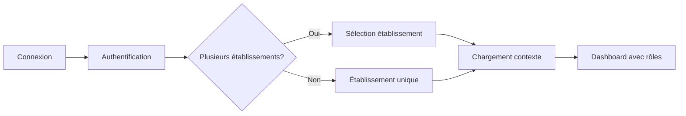

# 🏗️ Architecture Multi-Établissements SANTE.GA

## 📋 Problème Identifié

### Situation Actuelle (INCORRECTE ❌)
- **Deux systèmes d'authentification** coexistent :
  - `OfflineAuthContext` (mode démo/offline)
  - `AuthContext` (Supabase réel)
- Le dashboard SOGARA utilise `OfflineAuth` → affiche "Super Admin" par défaut
- Les métadonnées ne sont pas correctement synchronisées

### Résultat
- Le directeur SOGARA (Dr. Jules DJEKI) apparaît comme "SA - Super Admin"
- Les rôles ne sont pas correctement gérés par établissement

---

## ✅ Architecture Correcte : Multi-Établissements & Multi-Rôles

### 🎯 Concept Clé

```
Professionnel → Établissements → Rôles
```

Un **professionnel** peut :
- ✅ Travailler dans **plusieurs établissements**
- ✅ Avoir des **rôles différents** dans chaque établissement
- ✅ Sélectionner son contexte de travail à la connexion

### 📊 Modèle de Données

```sql
-- Table des professionnels
professionals (
  id UUID PRIMARY KEY,
  full_name TEXT,
  email TEXT UNIQUE,
  phone TEXT,
  license_number TEXT,
  speciality TEXT
)

-- Table des établissements
establishments (
  id UUID PRIMARY KEY,
  name TEXT,
  type TEXT, -- hospital, clinic, pharmacy, laboratory
  address TEXT,
  city TEXT,
  is_active BOOLEAN
)

-- Table de liaison : Professionnel ↔ Établissement
establishment_staff (
  id UUID PRIMARY KEY,
  professional_id UUID REFERENCES professionals(id),
  establishment_id UUID REFERENCES establishments(id),
  role TEXT, -- director, admin, doctor, nurse, etc.
  department TEXT, -- Urgences, Cardiologie, etc.
  is_active BOOLEAN,
  start_date DATE,
  end_date DATE
)
```

### 🔄 Flux de Connexion



---

## 🏥 Exemple : Dr. Jules DJEKI

### Profil
- **Nom** : Dr. Jules DJEKI
- **Email** : directeur.sogara@sante.ga

### Affiliations
| Établissement | Rôle | Département | Permissions |
|---------------|------|-------------|-------------|
| **CMST SOGARA** | Directeur | Direction Médicale | Toutes |
| **CHU Libreville** | Médecin consultant | Cardiologie | Consultations uniquement |
| **Clinique St-Michel** | Médecin vacataire | Urgences | Consultations + prescriptions |

### À la connexion
1. **Authentification** avec email/mot de passe
2. **Écran de sélection** :
   ```
   Choisissez votre établissement de travail :
   
   [✓] CMST SOGARA - Directeur
   [ ] CHU Libreville - Médecin consultant
   [ ] Clinique St-Michel - Médecin vacataire
   ```
3. **Contexte chargé** : CMST SOGARA + rôle Directeur
4. **Affichage** : "JD - Dr. Jules DJEKI - Directeur CMST SOGARA"

---

## 🛠️ Implémentation Technique

### 1. Context d'Authentification Unifié

```typescript
interface AuthContext {
  user: User;                    // Utilisateur Supabase
  professional: Professional;     // Profil professionnel
  establishments: Establishment[]; // Liste des établissements
  currentEstablishment?: Establishment; // Établissement actuel
  currentRole?: StaffRole;       // Rôle dans l'établissement actuel
  
  selectEstablishment: (id: string) => void;
  switchEstablishment: (id: string) => void;
}
```

### 2. Composant de Sélection d'Établissement

```typescript
// SelectEstablishment.tsx
function SelectEstablishment() {
  const { establishments, selectEstablishment } = useAuth();
  
  if (establishments.length === 1) {
    // Redirection automatique
    selectEstablishment(establishments[0].id);
    return <Navigate to="/dashboard" />;
  }
  
  return (
    <div>
      <h1>Choisissez votre établissement</h1>
      {establishments.map(est => (
        <EstablishmentCard 
          key={est.id}
          establishment={est}
          role={est.role}
          onClick={() => selectEstablishment(est.id)}
        />
      ))}
    </div>
  );
}
```

### 3. Layout avec Contexte

```typescript
// DashboardLayout.tsx
function DashboardLayout() {
  const { professional, currentEstablishment, currentRole } = useAuth();
  
  const fullName = professional?.full_name || 'Utilisateur';
  const initials = fullName.split(' ').map(n => n[0]).join('');
  const roleDisplay = `${currentRole?.role} - ${currentEstablishment?.name}`;
  
  return (
    <div>
      <Header>
        <Avatar>{initials}</Avatar>
        <span>{fullName}</span>
        <Badge>{roleDisplay}</Badge>
      </Header>
      {/* ... */}
    </div>
  );
}
```

---

## 🔧 Corrections Nécessaires

### 1. Supprimer OfflineAuthContext des pages de production
```typescript
// ❌ INCORRECT
import { useOfflineAuth } from "@/contexts/OfflineAuthContext";

// ✅ CORRECT
import { useAuth } from "@/contexts/AuthContext";
```

### 2. Mettre à jour SogaraDashboardLayout
```typescript
export function SogaraDashboardLayout({ children }: Props) {
  const { user } = useAuth(); // Pas useOfflineAuth
  
  // Récupérer le nom depuis les vraies métadonnées
  const fullName = user?.user_metadata?.full_name;
  const initials = fullName?.split(' ').map(n => n[0]).join('') || 'U';
  
  return (
    // Layout avec les bonnes données
  );
}
```

### 3. Implémenter le MultiEstablishmentContext correctement
```typescript
export function useMultiEstablishment() {
  const { user } = useAuth();
  const [establishments, setEstablishments] = useState([]);
  const [currentEstablishment, setCurrentEstablishment] = useState(null);
  
  useEffect(() => {
    // Charger les établissements du professionnel
    loadProfessionalEstablishments(user.id);
  }, [user]);
  
  return {
    establishments,
    currentEstablishment,
    selectEstablishment,
    // ...
  };
}
```

---

## 📝 Tables Supabase Nécessaires

```sql
-- 1. Créer la table des professionnels
CREATE TABLE professionals (
  id UUID PRIMARY KEY DEFAULT uuid_generate_v4(),
  user_id UUID REFERENCES auth.users(id),
  full_name TEXT NOT NULL,
  email TEXT UNIQUE NOT NULL,
  phone TEXT,
  license_number TEXT,
  speciality TEXT,
  created_at TIMESTAMPTZ DEFAULT NOW()
);

-- 2. Créer la table establishment_staff
CREATE TABLE establishment_staff (
  id UUID PRIMARY KEY DEFAULT uuid_generate_v4(),
  user_id UUID REFERENCES auth.users(id),
  establishment_id UUID REFERENCES establishments(id),
  role TEXT NOT NULL,
  department TEXT,
  is_active BOOLEAN DEFAULT true,
  is_establishment_admin BOOLEAN DEFAULT false,
  permissions JSONB,
  created_at TIMESTAMPTZ DEFAULT NOW()
);

-- 3. Index pour les requêtes
CREATE INDEX idx_staff_user ON establishment_staff(user_id);
CREATE INDEX idx_staff_establishment ON establishment_staff(establishment_id);
```

---

## 🚀 Plan d'Action

### Phase 1 : Correction Immédiate (1h)
1. ✅ Remplacer `useOfflineAuth` par `useAuth` dans SogaraDashboard
2. ✅ Corriger l'affichage du nom et des initiales
3. ✅ Tester avec le compte directeur

### Phase 2 : Architecture Multi-Établissements (3h)
1. ✅ Créer les tables de liaison dans Supabase
2. ✅ Implémenter le MultiEstablishmentContext
3. ✅ Créer la page de sélection d'établissement
4. ✅ Mettre à jour les layouts

### Phase 3 : Migration des Données (2h)
1. ✅ Migrer les comptes SOGARA existants
2. ✅ Créer les liens establishment_staff
3. ✅ Tester tous les rôles et permissions

---

## ✨ Résultat Final

Quand le Dr. Jules DJEKI se connecte :
1. **Email** : directeur.sogara@sante.ga
2. **Sélection** : CMST SOGARA (Directeur)
3. **Affichage** :
   - Avatar : **JD** (au lieu de SA)
   - Nom : **Dr. Jules DJEKI** (au lieu de Super Admin)
   - Rôle : **Directeur - CMST SOGARA**
4. **Permissions** : Accès complet à l'administration SOGARA

---

*Documentation créée le 30/10/2025*
