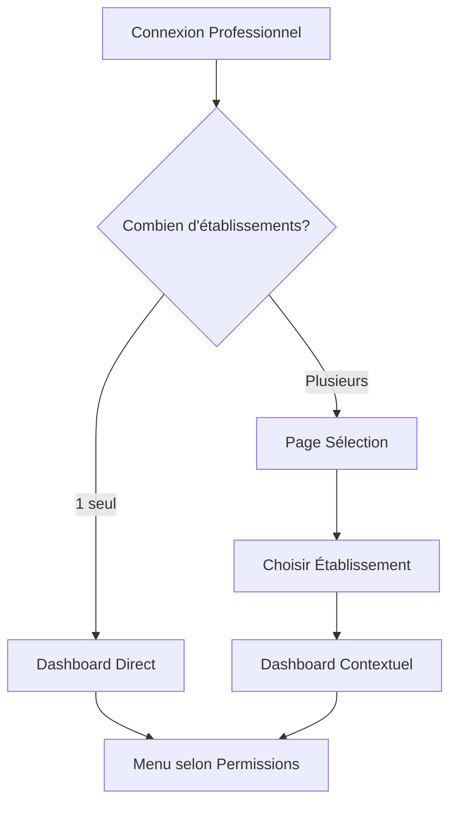

# 🚀 Guide de Démarrage Rapide - Espace Professionnel

## ✨ Nouvelle Architecture Multi-Établissements

---

## 1️⃣ Migration Immédiate (5 minutes)

### Étape 1 : Exécuter la Migration SQL
Copiez et exécutez dans **Supabase SQL Editor** :
```sql
-- Fichier: supabase/migrations/20251030_multi_establishments.sql
-- Exécutez tout le contenu du fichier
```

### Étape 2 : Lancer la Migration des Données
```bash
# Dans le terminal
./run-migration-multi-establishment.sh
```

---

## 2️⃣ Test Rapide avec SOGARA

### Connexion Directeur
```
Email: directeur.sogara@sante.ga
Mot de passe: Sogara2024!
```

**Vous verrez :**
- ✅ Dashboard avec toutes les options d'administration
- ✅ Menu complet incluant la gestion du personnel
- ✅ Badge "Direction" visible

### Connexion Médecin
```
Email: dr.okemba.sogara@sante.ga
Mot de passe: Sogara2024!
```

**Vous verrez :**
- ✅ Dashboard médical uniquement
- ✅ Pas d'options d'administration
- ✅ Menu limité aux consultations et prescriptions

---

## 3️⃣ Comprendre le Nouveau Flux



---

## 4️⃣ Fonctionnalités Clés

### 🏥 Multi-Établissements
Un professionnel peut maintenant :
- Travailler dans **plusieurs établissements**
- Avoir des **rôles différents** dans chaque structure
- **Changer facilement** via le sélecteur en header

### 🔐 Permissions Contextuelles
Le menu s'adapte automatiquement :
- **Directeur** → Tout voir, tout gérer
- **Admin** → Gestion sans configuration système
- **Médecin** → Consultations et prescriptions
- **Infirmier** → Soins et observations

### 📊 Dashboard Adaptatif
Contenu personnalisé selon :
- L'établissement sélectionné
- Le rôle dans cet établissement
- Les permissions accordées

---

## 5️⃣ Exemples Concrets

### Cas 1 : Dr. DJEKI (Multi-Rôles)
```javascript
Établissements:
1. CMST SOGARA → Directeur (tout gérer)
2. CHU Libreville → Médecin Consultant (consultations seulement)

Actions possibles:
- Au CMST : Gérer le personnel, voir les rapports
- Au CHU : Seulement consultations
```

### Cas 2 : Infirmière MBA (Mono-Établissement)
```javascript
Établissement:
1. CMST SOGARA → Infirmière Chef

Actions possibles:
- Voir les patients
- Administrer les soins
- PAS de gestion du personnel
```

---

## 6️⃣ Interface Utilisateur

### Header
```
[Logo] CMST SOGARA ▼ | Dr. Jules DJEKI [Avatar]
        ↓
   Sélecteur d'établissement
```

### Menu Latéral (Exemple Directeur)
```
📊 Vue d'ensemble
━━━━━━━━━━━━━━━
ACTIVITÉ MÉDICALE
📅 Rendez-vous
🩺 Consultations
📝 Prescriptions
━━━━━━━━━━━━━━━
ADMINISTRATION ⭐
👥 Personnel
💰 Facturation
📊 Rapports
━━━━━━━━━━━━━━━
```

### Menu Latéral (Exemple Médecin)
```
📊 Vue d'ensemble
━━━━━━━━━━━━━━━
ACTIVITÉ MÉDICALE
📅 Rendez-vous
🩺 Consultations
📝 Prescriptions
━━━━━━━━━━━━━━━
```

---

## 7️⃣ Commandes Utiles

### Ajouter un Professionnel à un Établissement
```sql
-- Dans Supabase SQL Editor
INSERT INTO establishment_staff (
  professional_id, 
  establishment_id,
  role,
  position
) VALUES (
  'uuid-professionnel',
  'uuid-etablissement',
  'doctor',
  'Médecin Senior'
);
```

### Vérifier les Permissions
```javascript
// Dans le code React
const { hasPermission } = useMultiEstablishment();

if (hasPermission('staff', 'edit')) {
  // Peut éditer le personnel
}
```

---

## 8️⃣ Troubleshooting

### ❓ "Je ne vois pas mes établissements"
1. Vérifiez que la migration SQL a été exécutée
2. Lancez le script de migration des données
3. Déconnectez-vous et reconnectez-vous

### ❓ "Le menu ne change pas"
1. Changez d'établissement via le sélecteur
2. Rafraîchissez la page (F5)
3. Vérifiez vos permissions dans la base

### ❓ "Erreur de permissions"
1. Vérifiez votre rôle dans `establishment_staff`
2. Consultez `role_permissions` pour les droits
3. Contactez l'administrateur si nécessaire

---

## 9️⃣ Pour les Développeurs

### Structure des Fichiers
```
src/
├── contexts/
│   └── MultiEstablishmentContext.tsx  # Nouveau contexte
├── components/
│   └── layout/
│       └── ProfessionalEstablishmentLayout.tsx  # Layout adaptatif
├── pages/
│   └── professional/
│       ├── SelectEstablishment.tsx  # Sélection établissement
│       └── ProfessionalDashboard.tsx  # Dashboard unifié
```

### Hooks Disponibles
```typescript
import { useMultiEstablishment } from '@/contexts/MultiEstablishmentContext';

const {
  currentEstablishment,  // Établissement actuel
  establishments,        // Liste des établissements
  hasPermission,        // Vérifier une permission
  isAdmin,             // Est administrateur
  isDirector,          // Est directeur
  switchEstablishment  // Changer d'établissement
} = useMultiEstablishment();
```

---

## 🎯 Checklist de Validation

- [ ] Migration SQL exécutée
- [ ] Script de migration lancé
- [ ] Test connexion directeur
- [ ] Test connexion médecin
- [ ] Vérification changement établissement
- [ ] Validation des menus contextuels
- [ ] Test des permissions

---

## 📞 Support

**En cas de problème :**
1. Consultez `IMPLEMENTATION_ESPACE_PROFESSIONNEL.md`
2. Vérifiez les logs Supabase
3. Contactez l'équipe technique

---

**🎉 Félicitations !**  
L'espace professionnel multi-établissements est maintenant opérationnel.

---

*Guide créé le 30/10/2025 - Version 1.0*
