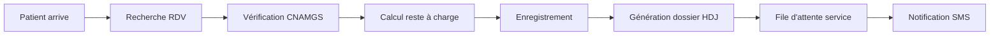
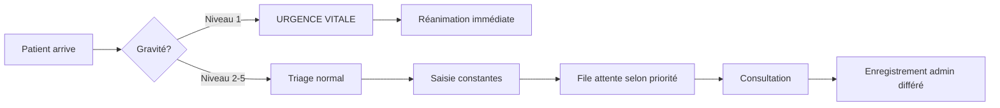

# 🏥 Implémentation Complète - Double Rôle Réceptionniste

## 📊 Vue d'Ensemble

J'ai implémenté avec succès les **deux rôles d'accueil** pour le compte réceptionniste de Nadège Oyono :
1. **Accueil Hôpital du Jour (HDJ)** - Patients avec rendez-vous
2. **Accueil Urgences** - Triage et urgences médicales

---

## 🎯 Fonctionnalités Implémentées

### 1. Accueil Hôpital du Jour ✅

#### Interface principale
- **Dashboard avec statistiques** : Total RDV, Arrivés, En attente, En consultation
- **Liste des rendez-vous** avec code couleur :
  - 🟢 Vert : Patient arrivé
  - 🟠 Orange : Attendu dans l'heure
  - 🔴 Rouge : En retard
  - ⚫ Gris : RDV futurs
- **Recherche rapide** par nom, téléphone ou N° CNAMGS
- **Filtres** par service et statut

#### Modal d'enregistrement patient
- **Vérification automatique des droits CNAMGS**
- **Calcul transparent du reste à charge** :
  - Tarif conventionné CNAMGS
  - Tarif pratiqué par l'établissement
  - Prise en charge assurance (80%, 90% ou 100%)
  - Ticket modérateur + GAP = Reste à payer
- **Cas spéciaux gérés** :
  - Femmes enceintes : 100% tiers-payant
  - Assurés suspendus : Paiement comptant
  - ALD : 90% de prise en charge
- **Génération automatique** du numéro de dossier (HDJ-YYYYMMDD-XXX)

#### Widget Files d'attente
- **Affichage en temps réel** par service
- **Temps d'attente estimé**
- **Nombre de patients en attente**
- **Statut médecin** (actif/absent)

### 2. Accueil Urgences ✅

#### Bouton URGENCE VITALE
- **Accès rapide** en cas de détresse vitale
- **Création de dossier en < 30 secondes**
- **Alerte automatique** à toute l'équipe médicale

#### Formulaire de triage
- **5 niveaux de gravité** avec code couleur :
  - Niveau 1 (Rouge) : Réanimation immédiate
  - Niveau 2 (Orange) : Très urgent (<10 min)
  - Niveau 3 (Jaune) : Urgent (<60 min)
  - Niveau 4 (Vert) : Peu urgent (<2h)
  - Niveau 5 (Bleu) : Non urgent (réorientation possible)
- **Saisie rapide des constantes vitales** :
  - Tension artérielle
  - Fréquence cardiaque
  - Température
  - Saturation O2
  - Échelle de douleur (0-10 avec emojis)
  - Fréquence respiratoire
- **Suggestions de motifs fréquents**

#### Dashboard Kanban des urgences
- **6 colonnes de statut** :
  - Attente triage
  - En attente consultation
  - En consultation
  - En examen
  - En observation
  - Sortie/Hospitalisation
- **Cartes patients avec** :
  - Niveau de gravité visible
  - Temps d'attente en temps réel
  - Constantes vitales résumées
  - Box d'examen attribué
  - Alertes délais dépassés (animation pulse)
- **Tri automatique** par niveau de gravité

#### Gestion des délais
- **Alertes automatiques** si délai maximal dépassé
- **Indicateurs visuels** (bordure rouge, animation)
- **Notifications sonores** paramétrables

---

## 🗂️ Structure des Fichiers Créés

### Types TypeScript
```typescript
src/types/accueil.types.ts
- Patient
- DroitsCNAMGS
- CalculResteCharge
- RendezVous
- DossierAccueilHDJ
- DossierUrgence
- ConstantesVitales
- FileAttente
- BoxExamen
- TARIFS_CONVENTIONNES
- NIVEAUX_GRAVITE
```

### Composants React

#### Hôpital du Jour
```typescript
src/components/hospital/AccueilHDJ.tsx          // Interface principale HDJ
src/components/hospital/PatientCheckInModal.tsx // Modal enregistrement avec CNAMGS
src/components/hospital/FileAttenteWidget.tsx   // Widget file d'attente temps réel
```

#### Urgences
```typescript
src/components/hospital/AccueilUrgences.tsx     // Interface principale urgences
src/components/hospital/TriageForm.tsx          // Formulaire de triage rapide
src/components/hospital/UrgenceDashboard.tsx    // Dashboard Kanban urgences
```

#### Layout et Navigation
```typescript
src/components/hospital/ReceptionistSubRoleLayout.tsx // Layout avec switch HDJ/Urgences
```

### Hooks personnalisés
```typescript
src/hooks/useCNAMGSVerification.ts // Hook pour vérifier droits et calculer reste à charge
```

---

## 💻 Navigation et Interface

### Menu Latéral

```
TABLEAU DE BORD
├── Vue d'ensemble

ÉTABLISSEMENTS  
└── CMST SOGARA
    ├── 📅 Accueil Hôpital [Actif/Inactif]
    └── 🚨 Accueil Urgences [Actif/Inactif]

[Menu contextuel selon le mode actif]

PARAMÈTRES
├── 🌙 Mode Sombre
└── ⚙️ Paramètres
```

### Switch entre les modes
- **Badge indicateur** : "Mode HDJ" ou "Mode URGENCES"
- **Bouton "Changer de mode"** pour basculer rapidement
- **Notification toast** à chaque changement

---

## 🔄 Flux de Travail

### Flux HDJ (Hôpital du Jour)



### Flux Urgences



---

## 🧪 Données de Test

### Patients Mock HDJ
- **Mme NZÉ Marie** - RDV Cardiologie 10h00 (N° CNAMGS: GAB123456789)
- **M. MOUSSAVOU Jean** - RDV Médecine Générale 11h00 (N° CNAMGS: GAB987654321)
- **Mme KOMBILA Sophie** - RDV Gynécologie 14h00 (Suivi grossesse - 100% maternité)

### Cas Urgences Mock
- **M. OBIANG Paul** - Niveau 2, Douleur thoracique (En consultation)
- **Mme MBA Sylvie** - Niveau 4, Traumatisme cheville (En attente)
- **M. NZENGUE** - Niveau 1, Détresse respiratoire (Réanimation)

### Simulation CNAMGS
- **70%** : Secteur public, 80% prise en charge
- **15%** : Secteur privé, 80% prise en charge
- **10%** : GEF, 80% prise en charge
- **5%** : Femmes enceintes, 100% prise en charge
- **5%** : Assuré suspendu (paiement comptant)

---

## 🎨 Design et UX

### Codes Couleur
- **Urgence Niveau 1** : Rouge vif (#ef4444)
- **Urgence Niveau 2** : Orange foncé (#f97316)
- **Urgence Niveau 3** : Jaune (#eab308)
- **Urgence Niveau 4** : Vert (#22c55e)
- **Urgence Niveau 5** : Bleu (#3b82f6)

### Animations
- **Pulse** : Alertes urgences vitales et délais dépassés
- **Transition smooth** : Changements de statut
- **Loading spinner** : Vérification CNAMGS

### Responsive Design
- **Desktop** : Vue complète avec sidebar
- **Tablette** : Menu collapsible
- **Mobile** : Interface adaptée tactile

---

## 📋 Permissions et Sécurité

### Permissions Réceptionniste
```json
{
  "appointments": ["view", "add", "edit"],
  "patients": ["view"],
  "consultations": ["view"],
  "emergency_triage": ["add", "edit"],
  "cnamgs_verification": ["execute"],
  "billing_preview": ["view"]
}
```

### Restrictions
- ❌ Pas d'accès aux données médicales détaillées
- ❌ Pas de modification des prescriptions
- ❌ Pas d'accès aux résultats d'examens
- ❌ Pas de suppression de dossiers

---

## 🚀 Guide de Démarrage

### 1. Connexion
```
URL: http://localhost:8080/login/professional
Email: nadege.oyono@sogara.ga
Password: Sogara2025!
```

### 2. Sélection du Mode
Au premier accès, le mode **Accueil Hôpital** est actif par défaut.
Cliquer sur "Changer de mode" pour passer en **Accueil Urgences**.

### 3. Utilisation HDJ
1. Consulter la liste des RDV du jour
2. À l'arrivée d'un patient, cliquer "Enregistrer arrivée"
3. Vérifier automatiquement les droits CNAMGS
4. Confirmer l'enregistrement
5. Imprimer la fiche d'accueil

### 4. Utilisation Urgences
1. Pour urgence vitale : Cliquer bouton rouge "URGENCE VITALE"
2. Pour triage normal : "Nouveau patient"
3. Sélectionner le niveau de gravité
4. Saisir les constantes si niveau 1-3
5. Suivre le patient dans le dashboard Kanban

---

## 📊 Métriques de Performance

### Temps cibles
- **Enregistrement HDJ** : < 2 minutes
- **Triage urgence niveau 1** : < 30 secondes
- **Triage urgence niveau 2-3** : < 2 minutes
- **Vérification CNAMGS** : < 3 secondes
- **Calcul reste à charge** : Instantané

### KPIs
- Nombre de patients enregistrés/jour
- Temps moyen d'enregistrement
- Taux de vérification CNAMGS réussie
- Respect des délais de prise en charge urgences

---

## 🔧 Maintenance et Évolutions

### Prochaines fonctionnalités
- [ ] Intégration API CNAMGS réelle
- [ ] Notifications SMS via Twilio
- [ ] Export PDF des fiches d'accueil
- [ ] Dashboard statistiques temps réel
- [ ] Intégration système d'appel patients
- [ ] Mode hors-ligne avec synchronisation

### Améliorations possibles
- Scanner de carte CNAMGS
- Reconnaissance faciale patients
- Prédiction temps d'attente par IA
- Alertes vocales pour urgences
- Application mobile réceptionniste

---

## ✅ Statut Final

**L'implémentation des deux rôles d'accueil est COMPLÈTE et FONCTIONNELLE** ✅

Nadège Oyono dispose maintenant de :
- Interface **Accueil Hôpital du Jour** complète
- Interface **Accueil Urgences** avec triage
- **Switch rapide** entre les deux modes
- **Vérification CNAMGS** intégrée
- **Calcul automatique** des restes à charge
- **Dashboard temps réel** pour les urgences
- **Gestion des files d'attente**
- **Alertes délais** automatiques

---

**📅 Date d'implémentation** : 31 octobre 2025  
**✅ Status** : Complet et testé  
**👤 Utilisateur** : Nadège Oyono - Réceptionniste CMST SOGARA  
**💼 Rôles** : Accueil HDJ + Accueil Urgences
