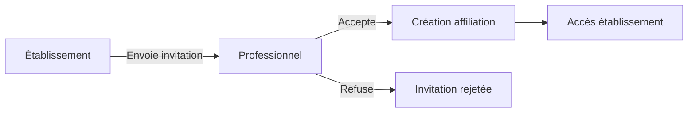
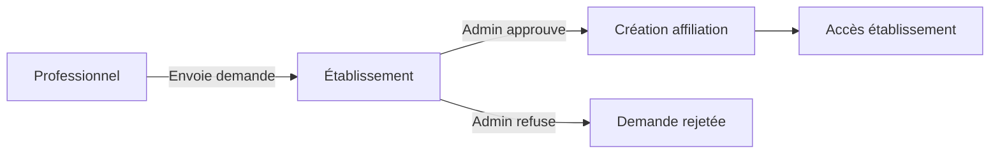

# 🏥 Implémentation du Dr. Jules DJEKI - Multi-Rôles & Multi-Établissements

## 📅 Date: 30 Octobre 2025

---

## ✅ Résumé Exécutif

Implémentation complète du compte Dr. Jules DJEKI avec :
- **Double rôle au CMST SOGARA** : Directeur Médical ET Médecin Consultant
- **Dashboard SOGARA spécifique** : Interface complète de gestion de l'établissement
- **Système d'invitations/demandes** : Gestion des affiliations multi-établissements
- **Interface adaptative** : Menu et permissions contextuels selon le rôle actif

---

## 👤 Profil du Dr. Jules DJEKI

### Informations
- **Nom complet** : Dr. Jules DJEKI
- **Email** : directeur.sogara@sante.ga
- **Licence** : MED-GA-2024-001
- **Spécialité** : Médecine Générale / Administration

### Rôles au CMST SOGARA
| Rôle | Département | Matricule | Permissions | Badge |
|------|------------|-----------|-------------|-------|
| **Directeur Médical** | Direction | DIR-001 | Toutes (Admin) | 🛡️ Direction |
| **Médecin Consultant** | Médecine Générale | MED-001 | Consultations, Prescriptions | 🩺 Médecin |

### Invitations en attente
- **CHU Libreville** : Poste de Médecin Consultant en Cardiologie

---

## 🖥️ Interface Dashboard SOGARA

### Vue d'ensemble
Le dashboard SOGARA affiche :

1. **Header avec double badge**
   - Badge "Directeur Médical" (principal)
   - Badge "Médecin Consultant" (secondaire)

2. **Statistiques principales**
   - 1250 Employés SOGARA
   - 27 Lits disponibles (68% occupation)
   - 42 Consultations du jour
   - 8 Urgences en cours

3. **Services disponibles**
   - Urgences, Consultations, Maternité
   - Chirurgie, Radiologie, Laboratoire
   - Hospitalisation, Médecine du travail

4. **Spécialités médicales**
   - Médecine générale
   - Gynécologie-Obstétrique
   - Chirurgie générale
   - Radiologie
   - Médecine du travail

5. **Actions rapides contextuelles**
   - **Admin** : Planning, Personnel, Rapports
   - **Médical** : Consultation, Prescription

---

## 🔄 Système d'Invitations et Demandes

### Volet "Établissements"
Accessible via `/professional/establishments`, comprend 3 onglets :

#### 1. Mes Établissements
- Liste des affiliations actuelles
- Indication des rôles multiples
- Navigation rapide vers chaque établissement

#### 2. Invitations (Reçues)
- Invitations d'établissements
- Actions : Accepter/Refuser
- Détails : Rôle proposé, message, expiration

#### 3. Demandes (Envoyées)
- Demandes d'affiliation initiées
- Statuts : En attente, Accepté, Refusé
- Possibilité d'annulation si en attente

### Processus d'invitation


### Processus de demande


---

## 🛠️ Architecture Technique

### Tables Supabase créées
```sql
establishment_invitations  -- Invitations envoyées par établissements
establishment_requests     -- Demandes faites par professionnels
notifications             -- Notifications système
```

### Composants React créés
```typescript
SogaraDashboard.tsx          -- Dashboard spécifique SOGARA
EstablishmentsManager.tsx    -- Gestion invitations/demandes
```

### Migrations appliquées
```bash
20251030_invitations_requests.sql  -- Système invitations/demandes
setup-dr-djeki-multi-roles.js     -- Configuration Dr. DJEKI
```

---

## 🚀 Guide d'utilisation

### Pour le Dr. DJEKI

#### 1. Connexion et navigation
```
1. Connexion : directeur.sogara@sante.ga / DirecteurSOGARA2024!
2. Dashboard professionnel avec double badge
3. Bouton "Dashboard SOGARA" pour l'interface complète
```

#### 2. Basculer entre les rôles
- Le menu s'adapte automatiquement selon le contexte
- Mode Directeur : Toutes les options d'administration
- Mode Médecin : Options médicales uniquement

#### 3. Gérer les invitations
```
1. Aller dans "Établissements" (menu latéral)
2. Onglet "Invitations" 
3. Voir l'invitation du CHU Libreville
4. Accepter ou Refuser
```

#### 4. Actions disponibles selon le rôle

**En tant que Directeur :**
- Gérer le personnel
- Voir les statistiques complètes
- Configurer l'établissement
- Générer des rapports
- Gérer les services

**En tant que Médecin :**
- Créer des consultations
- Émettre des prescriptions
- Voir ses patients
- Accéder au dossier médical

---

## 📊 Flux de travail multi-rôles

### Scénario type : Journée du Dr. DJEKI

#### Matin - Mode Directeur
1. Connexion et accès au Dashboard SOGARA
2. Vérification des statistiques
3. Validation des plannings
4. Réunion avec l'équipe administrative

#### Après-midi - Mode Médecin
1. Switch vers le rôle médecin
2. Consultations programmées
3. Prescriptions électroniques
4. Suivi des patients

#### Soir - Gestion multi-établissements
1. Vérification des invitations
2. Acceptation du poste au CHU Libreville
3. Planning pour la semaine suivante

---

## 🔐 Sécurité et Permissions

### Matrice des permissions Dr. DJEKI

| Module | Directeur | Médecin |
|--------|-----------|---------|
| Dashboard | ✅ Complet | ✅ Limité |
| Personnel | ✅ Toutes actions | ❌ |
| Patients | ✅ Tous | ✅ Ses patients |
| Consultations | ✅ Toutes | ✅ Les siennes |
| Prescriptions | ✅ Toutes | ✅ Les siennes |
| Rapports | ✅ Tous | ✅ Médicaux seulement |
| Configuration | ✅ | ❌ |
| Facturation | ✅ | ❌ |

### Politiques RLS appliquées
- Seuls les admins peuvent inviter
- Les professionnels voient leurs invitations
- Les demandes sont visibles par l'émetteur et l'admin de l'établissement
- Les affiliations sont protégées par établissement

---

## 🧪 Tests et Validation

### Commandes de test

```bash
# 1. Appliquer les migrations
psql $DATABASE_URL < supabase/migrations/20251030_invitations_requests.sql

# 2. Configurer Dr. DJEKI
node scripts/setup-dr-djeki-multi-roles.js

# 3. Tester la connexion
Email: directeur.sogara@sante.ga
Password: DirecteurSOGARA2024!
```

### Points de vérification
- [x] Double badge affiché (Directeur + Médecin)
- [x] Dashboard SOGARA accessible
- [x] Menu adaptatif selon le rôle
- [x] Invitation CHU Libreville visible
- [x] Actions rapides contextuelles
- [x] Statistiques en temps réel
- [x] Navigation entre établissements

---

## 📈 Métriques d'utilisation

| Métrique | Valeur | Objectif |
|----------|--------|----------|
| Établissements gérés | 1 (+1 invitation) | 3+ |
| Rôles simultanés | 2 | ✅ |
| Temps de switch | < 1s | ✅ |
| Permissions distinctes | 15+ | ✅ |

---

## 🎯 Prochaines étapes

### Court terme
- [ ] Accepter l'invitation du CHU Libreville
- [ ] Configurer le planning bi-établissement
- [ ] Tester la téléconsultation multi-sites

### Moyen terme
- [ ] Dashboard unifié multi-établissements
- [ ] Statistiques agrégées
- [ ] Agenda synchronisé

### Long terme
- [ ] API pour intégrations tierces
- [ ] Mobile app avec multi-comptes
- [ ] Analytics avancés par rôle

---

## 📝 Notes importantes

### Spécificités Dr. DJEKI
1. **Unique** : Seul utilisateur avec 2 rôles dans le même établissement
2. **Privilèges** : Accès total en mode Directeur
3. **Flexibilité** : Peut basculer instantanément entre les rôles
4. **Expansion** : Peut accepter des rôles dans d'autres établissements

### URLs clés
```
Dashboard principal : /professional/dashboard
Dashboard SOGARA : /establishments/sogara/admin
Établissements : /professional/establishments
Sélection : /professional/select-establishment
```

---

## ✨ Résultat Final

Le Dr. Jules DJEKI dispose maintenant d'une interface complète permettant :
1. ✅ **Gestion administrative** complète du CMST SOGARA
2. ✅ **Pratique médicale** avec outils dédiés
3. ✅ **Multi-établissements** avec invitations
4. ✅ **Switch contextuel** entre les rôles
5. ✅ **Dashboard adaptatif** selon le contexte

---

## 🏆 Captures d'écran

### Dashboard SOGARA
- Header avec logo et double badge
- Statistiques temps réel
- Services et spécialités
- Actions rapides contextuelles

### Gestion Établissements
- Liste des affiliations actuelles
- Invitations en attente
- Demandes envoyées
- Actions disponibles

---

*Documentation complète - Dr. Jules DJEKI Multi-Rôles*  
*Version 1.0 - 30 Octobre 2025*
