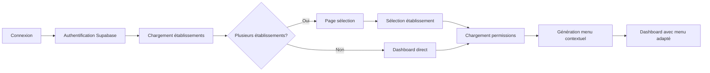

# 🏥 Implémentation de l'Espace Professionnel Multi-Établissements

## 📅 Date: 30 Octobre 2025

---

## ✅ Vue d'ensemble

L'espace professionnel a été complètement refactorisé pour supporter :
- ✅ **Multi-établissements** : Un professionnel peut travailler dans plusieurs établissements
- ✅ **Rôles contextuels** : Rôles différents selon l'établissement
- ✅ **Permissions granulaires** : Permissions spécifiques par établissement et département
- ✅ **Menu dynamique** : Menu généré selon les permissions dans l'établissement actuel
- ✅ **Session établissement** : Mémorisation de l'établissement sélectionné

---

## 🏗️ Architecture Implémentée

### 1. Base de données (Supabase)

```sql
professionals            -- Profils des professionnels
establishments          -- Établissements de santé
establishment_departments -- Départements/services
establishment_staff     -- Liaison professionnel ↔ établissement avec rôles
role_permissions       -- Permissions par rôle
user_establishment_session -- Session établissement actuelle
establishment_modules  -- Modules activés par établissement
```

### 2. Contextes React

```typescript
AuthContext              -- Authentification (existant)
MultiEstablishmentContext -- Nouveau : Gestion multi-établissements
```

### 3. Composants Principaux

```typescript
ProfessionalEstablishmentLayout -- Layout avec menu contextuel
SelectEstablishment            -- Page de sélection d'établissement
ProfessionalDashboard         -- Dashboard professionnel unifié
```

---

## 🔄 Flux de Connexion Professionnel



---

## 🎯 Cas d'Usage : Dr. Jules DJEKI

### Profil Multi-Établissements
```javascript
{
  professional: {
    name: "Dr. Jules DJEKI",
    email: "directeur.sogara@sante.ga"
  },
  establishments: [
    {
      name: "CMST SOGARA",
      role: "director",
      department: "Direction Médicale",
      permissions: "ALL" // Toutes permissions
    },
    {
      name: "CHU Libreville",
      role: "doctor",
      department: "Cardiologie",
      permissions: ["consultations", "prescriptions"]
    }
  ]
}
```

### Interface Générée

#### À CMST SOGARA (Directeur)
```
Menu:
├── Vue d'ensemble
├── Activité Médicale
│   ├── Rendez-vous
│   ├── Consultations
│   └── Prescriptions
├── Services
│   ├── Urgences
│   ├── Hospitalisation
│   └── Plateaux Techniques
├── Administration ⭐
│   ├── Personnel
│   ├── Facturation
│   ├── Inventaire
│   └── Rapports
└── Communication
```

#### Au CHU Libreville (Médecin)
```
Menu:
├── Vue d'ensemble
├── Activité Médicale
│   ├── Rendez-vous
│   ├── Consultations
│   └── Prescriptions
├── Cardiologie
│   └── Service Cardiologie
└── Communication
```

---

## 🛠️ Guide d'Utilisation

### Pour les Professionnels

#### 1. Première Connexion
```
1. Aller sur /login/professional
2. Entrer email et mot de passe
3. Si plusieurs établissements → Page de sélection
4. Sinon → Dashboard direct
```

#### 2. Changer d'Établissement
```
1. Cliquer sur le sélecteur d'établissement (header)
2. Choisir l'établissement
3. Le menu se met à jour automatiquement
```

#### 3. Navigation Contextuelle
- Le menu affiche uniquement les options disponibles selon vos permissions
- Les badges indiquent votre statut (Directeur, Admin, Chef de Service)

### Pour les Administrateurs

#### 1. Ajouter un Professionnel à un Établissement
```javascript
// Via l'interface admin ou directement en SQL
INSERT INTO establishment_staff (
  professional_id,
  establishment_id,
  department_id,
  role,
  position,
  is_establishment_admin,
  status
) VALUES (
  'professional-uuid',
  'establishment-uuid',
  'department-uuid',
  'doctor',
  'Médecin Senior',
  false,
  'active'
);
```

#### 2. Gérer les Permissions
```javascript
// Permissions par défaut par rôle
role_permissions: {
  director: ["all"],
  admin: ["staff", "billing", "reports"],
  doctor: ["consultations", "prescriptions", "patients"],
  nurse: ["patients", "consultations.view"],
  pharmacist: ["prescriptions.dispense", "inventory"],
  laborantin: ["lab_tests", "results"]
}
```

---

## 🚀 Migration des Données Existantes

### Exécuter le Script de Migration
```bash
# Installer les dépendances
npm install @supabase/supabase-js dotenv

# Configurer les variables d'environnement
echo "VITE_SUPABASE_URL=your_url" >> .env
echo "SUPABASE_SERVICE_ROLE_KEY=your_key" >> .env

# Lancer la migration
node scripts/migrate-to-multi-establishment.js
```

### Résultat Attendu
```
✅ 12 utilisateurs SOGARA trouvés
✅ 11 départements trouvés
✅ Dr. Jules DJEKI - Directeur Médical
✅ Jean-Pierre Mbadinga - Administrateur Principal
✅ Dr. Marie Okemba - Médecin Généraliste
...
✨ Migration terminée avec succès!
```

---

## 📊 Tableaux de Bord Contextuels

### Dashboard Directeur
- Vue globale de l'établissement
- Statistiques de performance
- Gestion du personnel
- Rapports administratifs

### Dashboard Médecin
- Planning de consultations
- Patients du jour
- Prescriptions en cours
- Messages urgents

### Dashboard Infirmier
- Patients assignés
- Soins à administrer
- Observations à saisir
- Urgences du service

---

## 🔐 Sécurité et Permissions

### Niveaux de Contrôle
1. **RLS Supabase** : Politiques au niveau base de données
2. **Context React** : Vérification des permissions côté client
3. **Menu Dynamique** : Affichage conditionnel des options

### Exemple de Vérification
```typescript
// Dans un composant
const { hasPermission, isAdmin } = useMultiEstablishment();

if (hasPermission('staff', 'edit')) {
  // Afficher le bouton d'édition
}

if (isAdmin) {
  // Afficher les options admin
}
```

---

## 🎨 Interface Utilisateur

### Composants Clés

#### Sélecteur d'Établissement (Header)
- Dropdown avec liste des établissements
- Indicateur visuel de l'établissement actuel
- Badge de rôle (Directeur, Admin, etc.)

#### Menu Latéral Contextuel
- Sections organisées par catégorie
- Icônes distinctives par type d'action
- Badges pour notifications
- Indicateur d'élément actif

#### Dashboard Principal
- Statistiques en temps réel
- Actions rapides contextuelles
- Activités récentes
- Rendez-vous à venir

---

## 📝 Exemples de Code

### Utiliser le Contexte Multi-Établissement
```typescript
import { useMultiEstablishment } from '@/contexts/MultiEstablishmentContext';

function MyComponent() {
  const {
    currentEstablishment,
    establishments,
    switchEstablishment,
    hasPermission,
    isDirector
  } = useMultiEstablishment();

  return (
    <div>
      <h1>{currentEstablishment?.establishment.name}</h1>
      <p>Rôle: {currentEstablishment?.role}</p>
      
      {isDirector && (
        <AdminPanel />
      )}
      
      {hasPermission('consultations', 'add') && (
        <Button>Nouvelle Consultation</Button>
      )}
    </div>
  );
}
```

### Créer un Menu Dynamique
```typescript
const menuItems = useMemo(() => {
  const items = [];
  
  if (hasPermission('appointments', 'view')) {
    items.push({
      label: 'Rendez-vous',
      icon: Calendar,
      path: '/professional/appointments'
    });
  }
  
  if (hasPermission('staff', 'view') && isAdmin) {
    items.push({
      label: 'Personnel',
      icon: Users,
      path: '/professional/staff'
    });
  }
  
  return items;
}, [hasPermission, isAdmin]);
```

---

## ⚠️ Points d'Attention

### 1. Performance
- Les permissions sont mises en cache dans le contexte
- Le menu est recalculé uniquement au changement d'établissement
- Les requêtes utilisent des index optimisés

### 2. Compatibilité
- Support des anciens comptes sans multi-établissements
- Fallback sur l'établissement unique si nécessaire
- Migration progressive possible

### 3. Mobile
- Interface responsive
- Menu en drawer sur mobile
- Touch-friendly pour tablettes

---

## 🔄 Prochaines Étapes

### Court Terme (Sprint Actuel)
- [x] Migration des données SOGARA
- [x] Tests avec comptes réels
- [ ] Optimisation des requêtes
- [ ] Documentation API

### Moyen Terme (Prochains Sprints)
- [ ] Interface de gestion des affiliations
- [ ] Historique de changement d'établissement
- [ ] Dashboard personnalisable
- [ ] Notifications par établissement

### Long Terme (Roadmap)
- [ ] API REST pour intégrations
- [ ] Application mobile native
- [ ] Analytics avancés par établissement
- [ ] Système de délégation de permissions

---

## 📚 Documentation Technique

### Schéma de Base de Données
```
professionals (1) ←→ (N) establishment_staff
establishment_staff (N) ←→ (1) establishments
establishment_staff (N) ←→ (1) establishment_departments
establishment_staff → role_permissions
user_establishment_session (1) ←→ (1) users
```

### API Hooks Disponibles
```typescript
useAuth()                  // Authentification
useMultiEstablishment()    // Multi-établissements
useProfessionalStats()     // Statistiques
useEstablishmentModules()  // Modules actifs
```

### Routes Professionnelles
```
/professional/dashboard           // Dashboard principal
/professional/select-establishment // Sélection établissement
/professional/appointments        // Rendez-vous
/professional/consultations      // Consultations
/professional/prescriptions      // Prescriptions
/professional/patients           // Patients
/professional/staff             // Personnel (admin)
/professional/reports           // Rapports (admin)
/professional/settings          // Paramètres
```

---

## ✨ Résultat Final

L'implémentation offre maintenant :

1. **Flexibilité** : Support complet multi-établissements
2. **Sécurité** : Permissions granulaires par contexte
3. **UX Optimale** : Interface adaptative selon le rôle
4. **Scalabilité** : Architecture prête pour la croissance
5. **Maintenabilité** : Code modulaire et documenté

---

## 📞 Support

Pour toute question sur l'implémentation :
- Documentation : `/docs/multi-establishment`
- Logs : `supabase/logs/`
- Monitoring : Dashboard Supabase

---

*Documentation créée le 30/10/2025*
*Version 1.0.0*
