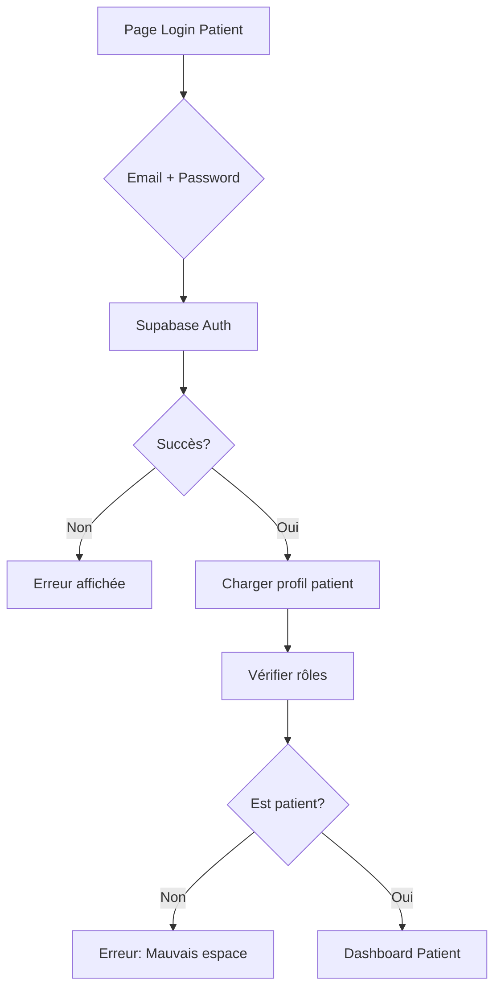
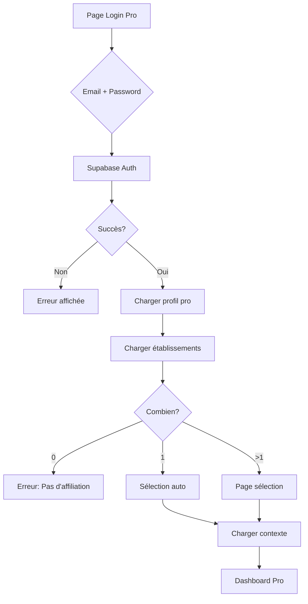
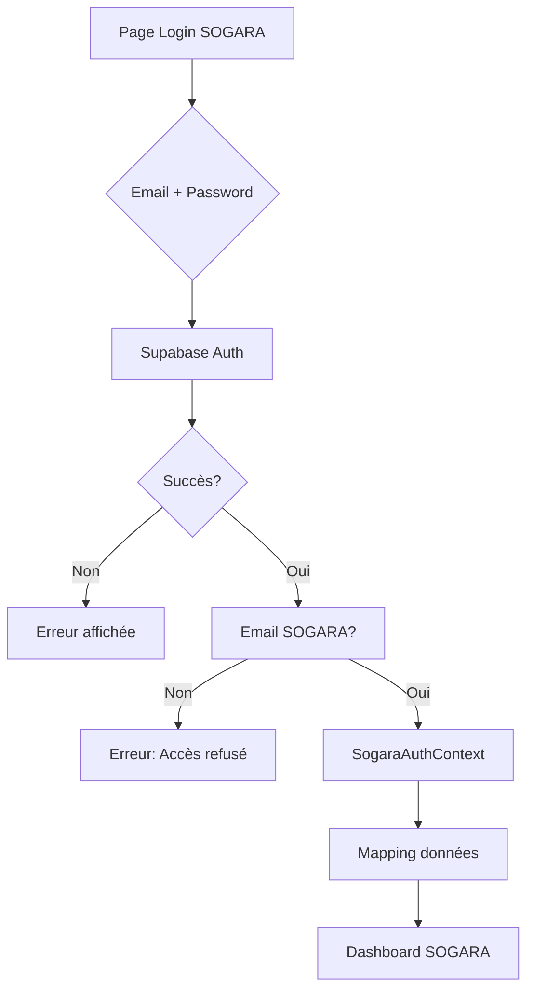

# 📊 RAPPORT COMPLET - ARCHITECTURE SANTE.GA

**Date**: 30 octobre 2025  
**Version**: 1.0  
**Projet**: SANTE.GA - Plateforme e-santé nationale du Gabon

---

## 📑 TABLE DES MATIÈRES

1. [Vue d'ensemble](#1-vue-densemble)
2. [Architecture des comptes](#2-architecture-des-comptes)
3. [Système de structures (établissements)](#3-système-de-structures-établissements)
4. [Logique des rôles et permissions](#4-logique-des-rôles-et-permissions)
5. [Contextes d'authentification](#5-contextes-dauthentification)
6. [Flux de connexion](#6-flux-de-connexion)
7. [Architecture technique](#7-architecture-technique)
8. [Base de données](#8-base-de-données)
9. [Cas d'usage](#9-cas-dusage)
10. [Recommandations](#10-recommandations)

---

## 1. VUE D'ENSEMBLE

### 1.1 Concept Global

SANTE.GA est une plateforme e-santé multi-acteurs qui connecte :
- **Patients** (grand public)
- **Professionnels de santé** (médecins, infirmiers, pharmaciens, etc.)
- **Établissements de santé** (hôpitaux, cliniques, pharmacies, laboratoires)
- **Administrateurs système** (gestion de la plateforme)

### 1.2 Principe Fondamental

```
Utilisateur → Type de compte → Rôles → Permissions → Actions
```

**Un utilisateur peut avoir plusieurs rôles dans plusieurs contextes (établissements).**

---

## 2. ARCHITECTURE DES COMPTES

### 2.1 Types de Comptes

#### 🏥 **A. Compte Patient**
- **Objectif**: Accès aux services de santé
- **Authentification**: Email + Mot de passe
- **Inscription**: Libre (auto-inscription)
- **Validation**: Email confirmé
- **Caractéristiques**:
  - Dossier Médical Partagé (DMP)
  - Prise de rendez-vous
  - Accès aux résultats d'examens
  - Téléconsultations
  - Remboursements CNAMGS/CNSS

```typescript
interface PatientAccount {
  id: UUID;
  email: string;
  full_name: string;
  birth_date: Date;
  gender: 'male' | 'female' | 'other';
  phone: string;
  address: string;
  
  // Santé
  blood_type?: string;
  allergies?: string[];
  chronic_diseases?: string[];
  
  // Assurances
  cnamgs_number?: string;
  cnss_number?: string;
  
  // Métadonnées
  created_at: Date;
  last_login?: Date;
}
```

#### 👨‍⚕️ **B. Compte Professionnel**
- **Objectif**: Exercer dans un ou plusieurs établissements
- **Authentification**: Email professionnel + Mot de passe
- **Inscription**: Demande avec validation
- **Validation**: Vérification des diplômes + numéro de licence
- **Caractéristiques**:
  - Multi-établissements
  - Multi-rôles (par établissement)
  - Accès DMP patients
  - Gestion consultations/prescriptions

```typescript
interface ProfessionalAccount {
  id: UUID;
  user_id: UUID; // Référence auth.users
  email: string;
  full_name: string;
  phone: string;
  
  // Professionnel
  speciality: string;
  license_number: string; // Ordre des médecins
  years_of_experience: number;
  diplomas: Diploma[];
  
  // Affiliations (clé du système)
  establishments: EstablishmentAffiliation[];
  
  // Métadonnées
  is_verified: boolean;
  verification_date?: Date;
  created_at: Date;
}
```

#### 🏢 **C. Compte Établissement (Admin)**
- **Objectif**: Gérer un établissement de santé
- **Authentification**: Email structure + Mot de passe
- **Inscription**: Demande avec dossier complet
- **Validation**: Vérification légale + agrément
- **Caractéristiques**:
  - Gestion du personnel
  - Configuration services
  - Statistiques établissement
  - Planning et horaires

```typescript
interface EstablishmentAdminAccount {
  user_id: UUID;
  establishment_id: UUID;
  role: 'owner' | 'director' | 'admin';
  permissions: string[];
  
  // Gestion
  can_manage_staff: boolean;
  can_manage_services: boolean;
  can_view_analytics: boolean;
  can_manage_billing: boolean;
}
```

#### 👑 **D. Compte Super Admin**
- **Objectif**: Administration globale de la plateforme
- **Authentification**: Email système + Mot de passe renforcé
- **Inscription**: Création manuelle uniquement
- **Validation**: N/A (création interne)
- **Caractéristiques**:
  - Accès complet à tous les modules
  - Validation des établissements
  - Gestion des utilisateurs
  - Accès aux logs et analytics
  - Configuration système

```typescript
interface SuperAdminAccount {
  id: UUID;
  email: string;
  full_name: string;
  role: 'super_admin';
  permissions: ['all'];
  
  // Sécurité renforcée
  two_factor_enabled: boolean;
  last_password_change: Date;
  access_logs: AccessLog[];
}
```

### 2.2 Hiérarchie des Comptes

```
┌─────────────────────────────────────────────────┐
│          SUPER ADMIN (Plateforme)               │
│  • Gestion globale                              │
│  • Validation établissements                    │
│  • Configuration système                        │
└──────────────────┬──────────────────────────────┘
                   │
        ┌──────────┴──────────┐
        │                     │
┌───────▼────────┐  ┌────────▼────────┐
│   ÉTABLISSEMENT │  │   ÉTABLISSEMENT │
│   (Admin local) │  │   (Admin local) │
│                 │  │                 │
│  ┌───────────┐  │  │  ┌───────────┐  │
│  │Directeur  │  │  │  │Directeur  │  │
│  └─────┬─────┘  │  │  └─────┬─────┘  │
│        │        │  │        │        │
│  ┌─────▼─────┐  │  │  ┌─────▼─────┐  │
│  │ Admin     │  │  │  │ Admin     │  │
│  └─────┬─────┘  │  │  └─────┬─────┘  │
│        │        │  │        │        │
│  ┌─────▼─────┐  │  │  ┌─────▼─────┐  │
│  │Personnel  │  │  │  │Personnel  │  │
│  │ Médical   │  │  │  │ Médical   │  │
│  └───────────┘  │  │  └───────────┘  │
└─────────────────┘  └─────────────────┘
        │                     │
        └──────────┬──────────┘
                   │
           ┌───────▼────────┐
           │    PATIENTS    │
           │  (Grand public)│
           └────────────────┘
```

---

## 3. SYSTÈME DE STRUCTURES (ÉTABLISSEMENTS)

### 3.1 Types d'Établissements

#### 🏥 **Hôpitaux**
- **Types**: CHU, CHR, CH, Hôpital militaire, Hôpital d'entreprise
- **Services**: Urgences, Consultations, Chirurgie, Hospitalisation
- **Personnel**: Médecins, infirmiers, techniciens, administratifs
- **Exemple**: CHU de Libreville, CMST SOGARA

#### 🏥 **Cliniques**
- **Types**: Privées, Confessionnelles
- **Services**: Consultations, Chirurgie ambulatoire, Maternité
- **Personnel**: Médecins, infirmiers, réceptionnistes
- **Exemple**: Clinique Mandji, Clinique St-Michel

#### 💊 **Pharmacies**
- **Types**: Officine, Hospitalière
- **Services**: Délivrance médicaments, Conseil
- **Personnel**: Pharmaciens, préparateurs
- **Exemple**: Pharmacie du Marché

#### 🔬 **Laboratoires**
- **Types**: Analyses médicales, Radiologie, Imagerie
- **Services**: Examens, Résultats
- **Personnel**: Biologistes, techniciens
- **Exemple**: Labo CIRMF

### 3.2 Structure d'un Établissement

```typescript
interface Establishment {
  // Identité
  id: UUID;
  name: string;
  type: 'hospital' | 'clinic' | 'pharmacy' | 'laboratory';
  sub_type?: string; // CHU, CHR, etc.
  
  // Localisation
  address: string;
  city: string;
  region: string;
  coordinates?: { lat: number; lng: number };
  
  // Contact
  phone: string;
  email: string;
  website?: string;
  
  // Services
  services: string[]; // ['Urgences', 'Consultations', 'Chirurgie']
  specialities: string[]; // ['Cardiologie', 'Pédiatrie']
  
  // Conventionnement
  accepts_cnamgs: boolean;
  accepts_cnss: boolean;
  
  // Configuration
  opening_hours: OpeningHours;
  appointment_enabled: boolean;
  teleconsultation_enabled: boolean;
  
  // Statut
  is_active: boolean;
  is_verified: boolean;
  verification_date?: Date;
  
  // Personnel (IMPORTANT)
  staff: EstablishmentStaff[];
}
```

### 3.3 Personnel d'un Établissement

```typescript
interface EstablishmentStaff {
  id: UUID;
  establishment_id: UUID;
  professional_id: UUID; // Référence au professionnel
  
  // Rôle DANS cet établissement
  role: 'director' | 'admin' | 'doctor' | 'nurse' | 'pharmacist' | 
        'lab_tech' | 'receptionist' | 'other';
  
  // Contexte
  department?: string; // 'Urgences', 'Cardiologie', etc.
  speciality?: string;
  
  // Permissions DANS cet établissement
  permissions: Permission[];
  is_establishment_admin: boolean;
  
  // Planning
  schedule: Schedule;
  availability: Availability[];
  
  // Contrat
  employment_type: 'full_time' | 'part_time' | 'vacation' | 'consultant';
  start_date: Date;
  end_date?: Date;
  
  // Statut
  is_active: boolean;
  status: 'active' | 'inactive' | 'suspended';
}
```

---

## 4. LOGIQUE DES RÔLES ET PERMISSIONS

### 4.1 Rôles Système (Global)

```typescript
enum SystemRole {
  SUPER_ADMIN = 'super_admin',     // Administration plateforme
  ADMIN = 'admin',                  // Administration générale
  PATIENT = 'patient',              // Utilisateur patient
  PROFESSIONAL = 'professional'     // Professionnel de santé (générique)
}
```

### 4.2 Rôles Professionnels (Par Établissement)

```typescript
enum ProfessionalRole {
  // Direction
  DIRECTOR = 'director',           // Directeur médical
  ADMIN = 'admin',                 // Administrateur établissement
  
  // Personnel médical
  DOCTOR = 'doctor',               // Médecin
  NURSE = 'nurse',                 // Infirmier(e)
  MIDWIFE = 'midwife',            // Sage-femme
  
  // Personnel paramédical
  PHARMACIST = 'pharmacist',       // Pharmacien
  PHARMACY_TECH = 'pharmacy_tech', // Préparateur
  LAB_TECH = 'lab_tech',          // Technicien labo
  RADIOLOGIST = 'radiologist',     // Radiologue
  
  // Personnel support
  RECEPTIONIST = 'receptionist',   // Réceptionniste
  MEDICAL_SECRETARY = 'medical_secretary',
  
  // Spécialisés
  PSYCHOLOGIST = 'psychologist',
  PHYSIOTHERAPIST = 'physiotherapist',
  NUTRITIONIST = 'nutritionist'
}
```

### 4.3 Permissions

```typescript
enum Permission {
  // Consultation
  VIEW_DMP = 'view_dmp',                    // Voir dossier médical
  EDIT_DMP = 'edit_dmp',                    // Modifier dossier
  CONSULTATION = 'consultation',             // Effectuer consultation
  PRESCRIPTION = 'prescription',             // Prescrire médicaments
  
  // Examens
  ORDER_LAB_TEST = 'order_lab_test',        // Prescrire examens
  VIEW_LAB_RESULTS = 'view_lab_results',    // Voir résultats
  VALIDATE_LAB_RESULTS = 'validate_lab_results', // Valider résultats
  
  // Hospitalisation
  ADMIT_PATIENT = 'admit_patient',          // Hospitaliser
  DISCHARGE_PATIENT = 'discharge_patient',   // Sortir patient
  
  // Urgences
  EMERGENCY_ACCESS = 'emergency_access',     // Accès urgences
  TRIAGE = 'triage',                        // Triage
  
  // Administratif
  MANAGE_APPOINTMENTS = 'manage_appointments', // Gérer RDV
  MANAGE_STAFF = 'manage_staff',            // Gérer personnel
  VIEW_ANALYTICS = 'view_analytics',        // Voir statistiques
  MANAGE_BILLING = 'manage_billing',        // Facturation
  
  // Pharmacie
  DISPENSE_MEDICATION = 'dispense_medication', // Délivrer médicaments
  MANAGE_STOCK = 'manage_stock',            // Gérer stock
  
  // Configuration
  MANAGE_SERVICES = 'manage_services',      // Configurer services
  MANAGE_SCHEDULE = 'manage_schedule'       // Gérer planning
}
```

### 4.4 Matrice Rôles → Permissions

| Rôle | Permissions |
|------|-------------|
| **Director** | Toutes (all) |
| **Admin** | manage_staff, view_analytics, manage_billing, manage_schedule, manage_services |
| **Doctor** | view_dmp, edit_dmp, consultation, prescription, order_lab_test, view_lab_results, admit_patient, discharge_patient |
| **Nurse** | view_dmp, edit_dmp (limité), emergency_access, triage, manage_appointments |
| **Pharmacist** | dispense_medication, manage_stock, view_dmp (limité aux prescriptions) |
| **Lab Tech** | order_lab_test, validate_lab_results, view_lab_results |
| **Receptionist** | manage_appointments, view_analytics (limité) |

---

## 5. CONTEXTES D'AUTHENTIFICATION

### 5.1 Architecture des Contextes

```typescript
// 1. AuthContext (Base - Supabase)
interface AuthContext {
  user: User | null;              // Utilisateur Supabase
  session: Session | null;        // Session active
  userRoles: AppRole[];           // Rôles globaux
  
  signIn: (email, password) => Promise<void>;
  signUp: (email, password, metadata) => Promise<void>;
  signOut: () => Promise<void>;
  
  hasRole: (role: AppRole) => boolean;
  hasAnyRole: (roles: AppRole[]) => boolean;
}

// 2. MultiEstablishmentContext (Professionnels)
interface MultiEstablishmentContext {
  establishments: StaffRole[];           // Liste des établissements
  currentEstablishment: StaffRole | null; // Établissement actuel
  
  selectEstablishment: (id: string) => void;
  switchEstablishment: (id: string) => void;
  refreshEstablishments: () => Promise<void>;
  
  // Helpers
  isAdmin: boolean;
  isDirector: boolean;
  canManageStaff: boolean;
}

// 3. SogaraAuthContext (Spécifique SOGARA)
interface SogaraAuthContext {
  user: SogaraUser | null;
  isLoading: boolean;
  
  // Rôles spécifiques
  isDirector: boolean;
  isAdmin: boolean;
  isDoctor: boolean;
  isNurse: boolean;
  
  hasPermission: (permission: string) => boolean;
}

// 4. OfflineAuthContext (Démo uniquement)
// ⚠️ À NE PAS UTILISER en production
interface OfflineAuthContext {
  user: OfflineUser | null;
  // Mode démo/offline
}
```

### 5.2 Hiérarchie d'Utilisation

```
┌─────────────────────────────────────┐
│         AuthProvider                │
│   (Base - Tous les utilisateurs)   │
│   • Authentification Supabase       │
│   • Session management              │
│   • Rôles globaux                   │
└───────────────┬─────────────────────┘
                │
    ┌───────────┴───────────┐
    │                       │
┌───▼──────────────┐  ┌────▼─────────────────┐
│ MultiEstablish-  │  │  SogaraAuthProvider  │
│ mentProvider     │  │  (Spécifique SOGARA) │
│ (Professionnels) │  │                      │
│ • Multi-contexts │  │  • Mapping SOGARA    │
│ • Sélection      │  │  • Permissions       │
└──────────────────┘  └──────────────────────┘
```

### 5.3 Flux d'Authentification Complet

```
1. CONNEXION
   ↓
[AuthProvider] Authentification Supabase
   ↓
2. CHARGEMENT PROFIL
   ↓
   ├─→ Patient ? → PatientContext
   │
   ├─→ Professionnel ?
   │   ↓
   │   [MultiEstablishmentContext]
   │   Charge les établissements
   │   ↓
   │   Plusieurs établissements ?
   │   ├─→ Oui → Page de sélection
   │   └─→ Non → Sélection automatique
   │       ↓
   │       Dashboard avec contexte établissement
   │
   ├─→ SOGARA ?
   │   ↓
   │   [SogaraAuthContext]
   │   Mapping automatique
   │   ↓
   │   Dashboard SOGARA
   │
   └─→ Super Admin ?
       ↓
       Dashboard Admin Global
```

---

## 6. FLUX DE CONNEXION

### 6.1 Connexion Patient



### 6.2 Connexion Professionnel



### 6.3 Connexion SOGARA (Actuel)



---

## 7. ARCHITECTURE TECHNIQUE

### 7.1 Stack Technologique

```typescript
// Frontend
- React 18.x
- TypeScript
- Vite (Build tool)
- TailwindCSS (Styling)
- shadcn/ui (Components)
- React Router (Navigation)
- React Query (Data fetching)

// Backend / BaaS
- Supabase (PostgreSQL + Auth + Storage)
  - Authentication
  - Database (PostgreSQL)
  - Row Level Security (RLS)
  - Real-time subscriptions
  - Storage (Files/Images)

// State Management
- React Context API
- Hooks (useState, useEffect, useContext)

// Authentification
- Supabase Auth (JWT)
- Email/Password
- Session management
```

### 7.2 Structure du Code

```
src/
├── components/
│   ├── ui/                    # shadcn components
│   ├── layout/                # Layouts (dashboards)
│   │   ├── PatientDashboardLayout.tsx
│   │   ├── ProfessionalDashboardLayout.tsx
│   │   ├── SogaraDashboardLayout.tsx
│   │   └── SuperAdminLayoutSimple.tsx
│   ├── auth/                  # Auth components
│   └── medical/               # Medical components
│
├── contexts/                  # React Contexts
│   ├── AuthContext.tsx        # ⭐ Base auth (Supabase)
│   ├── MultiEstablishmentContext.tsx # ⭐ Multi-contexts
│   ├── SogaraAuthContext.tsx  # ⭐ SOGARA specific
│   ├── OfflineAuthContext.tsx # ⚠️ Demo only
│   └── LanguageContext.tsx
│
├── pages/                     # Pages/Routes
│   ├── patient/               # Patient pages
│   ├── professional/          # Professional pages
│   ├── admin/                 # Admin pages
│   └── establishments/        # Establishments
│       └── sogara/            # SOGARA specific
│
├── lib/                       # Libraries/Utils
│   ├── auth.ts               # Auth service
│   ├── supabase.ts           # Supabase client
│   └── utils.ts
│
├── hooks/                     # Custom hooks
│   ├── useAuth.ts
│   ├── useMultiEstablishment.ts
│   └── useSogaraAuth.ts
│
└── integrations/
    └── supabase/             # Supabase integration
        ├── client.ts
        └── types.ts
```

---

## 8. BASE DE DONNÉES

### 8.1 Tables Principales

#### **auth.users** (Supabase Auth)
```sql
CREATE TABLE auth.users (
  id UUID PRIMARY KEY,
  email TEXT UNIQUE NOT NULL,
  encrypted_password TEXT,
  email_confirmed_at TIMESTAMPTZ,
  created_at TIMESTAMPTZ,
  updated_at TIMESTAMPTZ,
  
  -- Métadonnées JSON
  raw_user_meta_data JSONB,
  raw_app_meta_data JSONB
);
```

#### **profiles** (Extension utilisateur)
```sql
CREATE TABLE public.profiles (
  id UUID PRIMARY KEY REFERENCES auth.users(id),
  full_name TEXT,
  email TEXT,
  phone TEXT,
  avatar_url TEXT,
  birth_date DATE,
  gender TEXT,
  address TEXT,
  city TEXT,
  
  -- Patient specific
  blood_type TEXT,
  allergies TEXT[],
  chronic_diseases TEXT[],
  cnamgs_number TEXT,
  cnss_number TEXT,
  
  -- Professional specific
  speciality TEXT,
  license_number TEXT,
  years_of_experience INTEGER,
  
  created_at TIMESTAMPTZ DEFAULT NOW(),
  updated_at TIMESTAMPTZ DEFAULT NOW()
);
```

#### **user_roles** (Rôles globaux)
```sql
CREATE TABLE public.user_roles (
  id UUID PRIMARY KEY DEFAULT uuid_generate_v4(),
  user_id UUID REFERENCES auth.users(id) ON DELETE CASCADE,
  role TEXT NOT NULL, -- 'patient', 'doctor', 'admin', etc.
  
  created_at TIMESTAMPTZ DEFAULT NOW(),
  
  UNIQUE(user_id, role)
);
```

#### **establishments** (Établissements)
```sql
CREATE TABLE public.establishments (
  id UUID PRIMARY KEY DEFAULT uuid_generate_v4(),
  name TEXT NOT NULL,
  type TEXT NOT NULL, -- 'hospital', 'clinic', 'pharmacy', 'laboratory'
  sub_type TEXT,
  
  -- Localisation
  address TEXT,
  city TEXT,
  region TEXT,
  coordinates POINT,
  
  -- Contact
  phone TEXT,
  email TEXT,
  website TEXT,
  
  -- Services
  services TEXT[],
  specialities TEXT[],
  
  -- Conventionnement
  accepts_cnamgs BOOLEAN DEFAULT false,
  accepts_cnss BOOLEAN DEFAULT false,
  
  -- Configuration
  opening_hours JSONB,
  appointment_enabled BOOLEAN DEFAULT true,
  teleconsultation_enabled BOOLEAN DEFAULT false,
  
  -- Statut
  is_active BOOLEAN DEFAULT true,
  is_verified BOOLEAN DEFAULT false,
  verification_date TIMESTAMPTZ,
  
  created_at TIMESTAMPTZ DEFAULT NOW(),
  updated_at TIMESTAMPTZ DEFAULT NOW()
);
```

#### **establishment_staff** (⭐ TABLE CLÉ)
```sql
CREATE TABLE public.establishment_staff (
  id UUID PRIMARY KEY DEFAULT uuid_generate_v4(),
  
  -- Relations
  establishment_id UUID REFERENCES establishments(id) ON DELETE CASCADE,
  user_id UUID REFERENCES auth.users(id) ON DELETE CASCADE,
  
  -- Rôle DANS cet établissement
  role TEXT NOT NULL, -- 'director', 'doctor', 'nurse', etc.
  department TEXT,
  speciality TEXT,
  
  -- Permissions DANS cet établissement
  permissions JSONB DEFAULT '[]'::jsonb,
  is_establishment_admin BOOLEAN DEFAULT false,
  
  -- Planning
  schedule JSONB,
  
  -- Contrat
  employment_type TEXT, -- 'full_time', 'part_time', etc.
  start_date DATE,
  end_date DATE,
  
  -- Statut
  is_active BOOLEAN DEFAULT true,
  status TEXT DEFAULT 'active', -- 'active', 'inactive', 'suspended'
  
  created_at TIMESTAMPTZ DEFAULT NOW(),
  updated_at TIMESTAMPTZ DEFAULT NOW(),
  
  UNIQUE(establishment_id, user_id, role)
);
```

### 8.2 Index Importants

```sql
-- Performances
CREATE INDEX idx_user_roles_user_id ON user_roles(user_id);
CREATE INDEX idx_profiles_email ON profiles(email);
CREATE INDEX idx_establishments_city ON establishments(city);
CREATE INDEX idx_establishments_type ON establishments(type);

-- ⭐ Critical pour multi-établissements
CREATE INDEX idx_staff_user ON establishment_staff(user_id);
CREATE INDEX idx_staff_establishment ON establishment_staff(establishment_id);
CREATE INDEX idx_staff_active ON establishment_staff(is_active) WHERE is_active = true;
```

### 8.3 Row Level Security (RLS)

```sql
-- Profils: Chacun voit son propre profil
CREATE POLICY "Users can view own profile"
  ON profiles FOR SELECT
  USING (auth.uid() = id);

-- Établissements: Tous peuvent voir les établissements actifs
CREATE POLICY "Anyone can view active establishments"
  ON establishments FOR SELECT
  USING (is_active = true AND is_verified = true);

-- Staff: Voir seulement ses propres affiliations
CREATE POLICY "Users can view own staff records"
  ON establishment_staff FOR SELECT
  USING (auth.uid() = user_id);

-- Staff: Admins peuvent voir tout le personnel de leur établissement
CREATE POLICY "Admins can view establishment staff"
  ON establishment_staff FOR SELECT
  USING (
    establishment_id IN (
      SELECT establishment_id 
      FROM establishment_staff 
      WHERE user_id = auth.uid() 
        AND is_establishment_admin = true
    )
  );
```

---

## 9. CAS D'USAGE

### 9.1 Dr. Jules DJEKI (Exemple Multi-Établissements)

#### Profil
```typescript
{
  id: "f927c7b0-85d0-46a1-83ff-bdfabc81f41f",
  email: "directeur.sogara@sante.ga",
  full_name: "Dr. Jules DJEKI",
  speciality: "Cardiologie",
  license_number: "DIR-001"
}
```

#### Affiliations
```typescript
[
  // CMST SOGARA - Directeur
  {
    establishment: {
      id: "sogara-001",
      name: "CMST SOGARA",
      type: "hospital"
    },
    role: "director",
    department: "Direction Médicale",
    permissions: ["all"],
    is_establishment_admin: true
  },
  
  // CHU Libreville - Consultant
  {
    establishment: {
      id: "chu-lib-001",
      name: "CHU de Libreville",
      type: "hospital"
    },
    role: "doctor",
    department: "Cardiologie",
    permissions: ["consultation", "prescription", "view_dmp"],
    is_establishment_admin: false
  },
  
  // Clinique St-Michel - Vacataire
  {
    establishment: {
      id: "stmichel-001",
      name: "Clinique St-Michel",
      type: "clinic"
    },
    role: "doctor",
    department: "Urgences",
    permissions: ["consultation", "prescription", "emergency_access"],
    is_establishment_admin: false
  }
]
```

#### Flux de Connexion

```
1. Se connecte avec directeur.sogara@sante.ga
2. Authentification réussie
3. Système charge ses 3 affiliations
4. Écran de sélection s'affiche:

   ┌────────────────────────────────────┐
   │  Choisissez votre établissement    │
   ├────────────────────────────────────┤
   │                                    │
   │  [✓] CMST SOGARA                  │
   │      Directeur - Direction Médicale│
   │                                    │
   │  [ ] CHU de Libreville            │
   │      Médecin - Cardiologie        │
   │                                    │
   │  [ ] Clinique St-Michel           │
   │      Médecin - Urgences           │
   │                                    │
   └────────────────────────────────────┘

5. Sélectionne "CMST SOGARA"
6. Contexte chargé:
   - Nom: Dr. Jules DJEKI
   - Établissement: CMST SOGARA
   - Rôle: Directeur
   - Permissions: Toutes
7. Dashboard SOGARA s'affiche avec:
   - Avatar: JD
   - Nom: Dr. Jules DJEKI
   - Rôle: Directeur - Direction Médicale
   - Accès complet à l'administration
```

### 9.2 Patient Standard

```typescript
{
  id: "patient-123",
  email: "patient@example.com",
  full_name: "Marie NKOLO",
  birth_date: "1985-03-15",
  phone: "+241 07 XX XX XX",
  cnamgs_number: "CNAMGS-123456",
  
  // Pas d'affiliations établissements
  // Accès: Son propre DMP uniquement
}
```

#### Actions Possibles
- ✅ Voir son DMP
- ✅ Prendre RDV
- ✅ Voir ses résultats
- ✅ Téléconsultation
- ❌ Accéder aux DMP d'autres patients
- ❌ Prescrire
- ❌ Gérer établissements

---

## 10. RECOMMANDATIONS

### 10.1 Court Terme (1-2 semaines)

#### ✅ **Créer les tables manquantes**
```sql
-- Déjà existant: profiles, user_roles, establishments
-- À créer:
- professionals (extension pour pros)
- establishment_staff (⭐ CRITIQUE)
- appointments
- consultations
- prescriptions
```

#### ✅ **Migrer les comptes SOGARA**
```javascript
// Script de migration
for (const staff of SOGARA_STAFF) {
  // 1. Créer user dans auth.users (déjà fait)
  // 2. Créer profile
  // 3. Créer professional
  // 4. Créer establishment_staff avec rôle
}
```

#### ✅ **Tester le multi-établissements**
- Créer un professionnel avec 2+ établissements
- Vérifier la sélection
- Vérifier le switch de contexte

### 10.2 Moyen Terme (1-2 mois)

#### ✅ **Unifier les contextes**
- Supprimer `OfflineAuthContext`
- Merger `SogaraAuthContext` dans `MultiEstablishmentContext`
- Un seul flux pour tous les professionnels

#### ✅ **Implémenter les permissions granulaires**
```typescript
// Au lieu de rôles simples
hasPermission('prescription') // true/false

// Implémenter
checkPermission(
  userId,
  establishmentId,
  'prescription'
) // Vérifie le contexte exact
```

#### ✅ **Ajouter la gestion du planning**
- Disponibilités par établissement
- Horaires de travail
- Congés

### 10.3 Long Terme (3-6 mois)

#### ✅ **Fédération d'identité**
- SSO (Single Sign-On)
- OAuth2 pour établissements
- Connexion avec compte Google/Microsoft

#### ✅ **Audit et logs**
```typescript
interface AuditLog {
  user_id: UUID;
  establishment_id: UUID;
  action: string;
  resource: string;
  timestamp: Date;
  ip_address: string;
  success: boolean;
}
```

#### ✅ **Analytics par établissement**
- Statistiques d'utilisation
- Performance par service
- Satisfaction patients

---

## 📊 RÉSUMÉ VISUEL

### Architecture Simplifiée

```
┌─────────────────────────────────────────────────────────┐
│                    PLATEFORME SANTE.GA                  │
│                                                         │
│  ┌──────────┐  ┌──────────┐  ┌──────────┐            │
│  │ PATIENTS │  │   PROS   │  │  ADMINS  │            │
│  └─────┬────┘  └─────┬────┘  └─────┬────┘            │
│        │             │              │                  │
│        │      ┌──────▼──────┐       │                  │
│        │      │ÉTABLISSEMENT│       │                  │
│        └──────►  (Contexte) ◄───────┘                  │
│               └──────┬──────┘                          │
│                      │                                 │
│               ┌──────▼──────┐                          │
│               │ PERMISSIONS │                          │
│               └──────┬──────┘                          │
│                      │                                 │
│               ┌──────▼──────┐                          │
│               │   ACTIONS   │                          │
│               └─────────────┘                          │
└─────────────────────────────────────────────────────────┘
```

### Principe Fondamental

```
🔑 CLÉ: Un professionnel = Plusieurs contextes
        Un contexte = Établissement + Rôle + Permissions

Exemple:
  Dr. DJEKI @ SOGARA = Directeur (toutes permissions)
  Dr. DJEKI @ CHU    = Consultant (consultation only)
  Dr. DJEKI @ Clinique = Vacataire (urgences only)
```

---

## 📝 CONCLUSION

L'architecture de SANTE.GA est conçue pour être :
- ✅ **Multi-acteurs** (patients, pros, établissements, admins)
- ✅ **Multi-établissements** (un pro peut travailler dans plusieurs structures)
- ✅ **Multi-rôles** (rôles différents par établissement)
- ✅ **Scalable** (supporte croissance et nouvelles fonctionnalités)
- ✅ **Sécurisée** (RLS, permissions granulaires)

### État Actuel
- ✅ Authentification de base fonctionnelle
- ✅ Système de rôles globaux
- ✅ SOGARA opérationnel (solution temporaire)
- ⚠️ Multi-établissements partiellement implémenté
- ⚠️ Tables de liaison à créer

### Prochaine Étape Critique
**Créer et peupler la table `establishment_staff`** pour activer le vrai système multi-établissements.

---

**Fin du rapport**  
*Version 1.0 - 30 octobre 2025*
