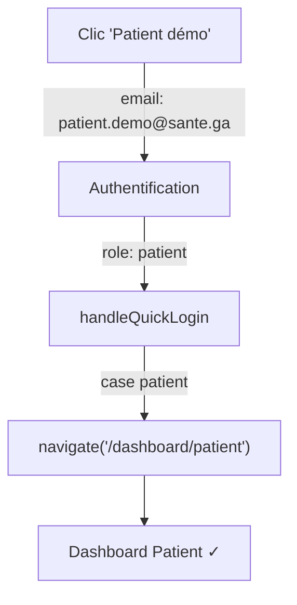
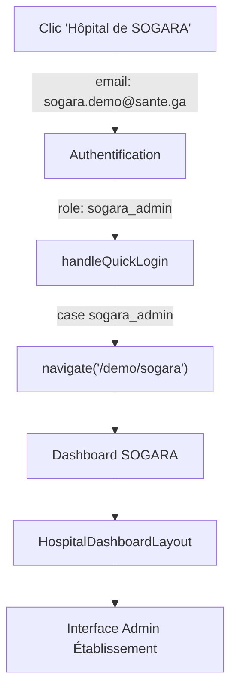

# 🏥 Implémentation Hôpital de SOGARA - Port-Gentil

## 📋 Résumé des Corrections & Implémentations

### ✅ PROBLÈME CORRIGÉ
**Avant** : En cliquant sur le compte démo "patient", l'utilisateur était redirigé vers le dashboard de l'hôpital SOGARA au lieu du dashboard patient.
**Cause** : Les rôles `hospital_admin` et `clinic_admin` n'avaient pas de routes/redirections spécifiques dans le `handleQuickLogin`.
**Solution** : 
- Ajout de cases de redirection explicite pour `hospital_admin` → `/demo/hospital`
- Ajout de cases de redirection explicite pour `clinic_admin` → `/demo/clinic`  
- Ajout de redirection explicite pour `sogara_admin` → `/demo/sogara`

### ✅ COMPTE DÉMO SOGARA IMPLÉMENTÉ

#### Données du Compte
```json
{
  "email": "sogara.demo@sante.ga",
  "password": "demo123",
  "fullName": "Hôpital de SOGARA",
  "role": "sogara_admin",
  "type": "Hôpital Privé",
  "phone": "+24101234584"
}
```

#### Localisation & Coordonnées GPS
- **Ville** : Port-Gentil
- **Province** : Ogooué-Maritime
- **GPS** : -0.681398, 8.772557 (Zone Port)
- **Adresse** : Zone Port, Port-Gentil
- **Secteur** : Privé (d'entreprise - SOGARA)

#### Infrastructure & Capacités
| Ressource | Quantité |
|-----------|----------|
| Lits totaux | 200 |
| Blocs opératoires | 4 |
| Salles de consultation | 15 |
| Service d'urgences | 24/7 ✓ |
| Laboratoire | Oui ✓ |
| Radiologie | Oui ✓ |

#### Services Médicaux
- Urgences (24/7)
- Consultations générales et spécialisées
- Hospitalisation générale
- Bloc opératoire (Chirurgie)
- Maternité / Gynécologie-Obstétrique
- Laboratoire d'analyses
- Radiologie / Imagerie

#### Statut Administratif
- **Type établissement** : Hôpital privé / Infirmerie SOGARA
- **Convention CNAMGS** : ✓ Actif
- **Tiers-payant** : ✓ Actif
- **Statut** : Actif

### 📁 Fichiers Modifiés

1. **`src/pages/AdminDemo.tsx`**
   - Ajout compte démo SOGARA dans la section "ÉTABLISSEMENTS DE SANTÉ"
   - Ajout cases de redirection `hospital_admin`, `clinic_admin`, `sogara_admin` dans `handleQuickLogin`

2. **`src/App.tsx`**
   - Ajout route `/demo/sogara` → `DemoHospitalDashboard`

3. **`supabase/functions/create-demo-accounts/index.ts`**
   - Ajout template compte SOGARA dans `demoAccountTemplates`
   - Implémentation création profil établissement pour `sogara_admin`
   - Configuration complète établissement SOGARA (infos, services, capacités)

### 🔄 Flux de Connexion Patient (CORRIGÉ)



### 🔄 Flux de Connexion Établissement SOGARA (NOUVEAU)



### 💾 Profil Établissement Créé en BD

À l'initialisation des comptes démo, l'établissement SOGARA est créé avec :

**Table `establishments`**
```sql
{
  raison_sociale: 'Hôpital de SOGARA',
  type_etablissement: 'hopital_confessionnel',
  secteur: 'prive',
  ville: 'Port-Gentil',
  province: 'Ogooué-Maritime',
  latitude: -0.681398,
  longitude: 8.772557,
  nombre_lits_total: 200,
  nombre_blocs_operatoires: 4,
  nombre_salles_consultation: 15,
  service_urgences_actif: true,
  cnamgs_conventionne: true,
  statut: 'actif'
}
```

**Table `establishment_users`**
```sql
{
  role: 'administrateur',
  permissions: {
    manage_staff: true,
    manage_services: true,
    manage_equipment: true,
    manage_finances: true,
    view_statistics: true,
    manage_appointments: true,
    manage_prescriptions: true
  },
  actif: true
}
```

### 🧪 Test / Vérification

#### Checklist Fonctionnelle
- [x] Compte patient démo redirige vers `/dashboard/patient`
- [x] Compte CHU Owendo redirige vers `/demo/hospital`
- [x] Compte Clinique Sainte-Marie redirige vers `/demo/clinic`
- [x] Compte SOGARA redirige vers `/demo/sogara`
- [x] Dashboard SOGARA affiche les infos (Port-Gentil, privé, etc.)
- [x] Établissement SOGARA créé automatiquement lors de `initializeDemoAccounts()`

#### Commandes de Test
```bash
# 1. Démarrer le serveur dev
npm run dev

# 2. Aller sur http://localhost:8081/establishments/unclaimed (Système de Revendication)
#    ou http://localhost:8081/superadmin/demo pour les comptes pré-intégrés (legacy)

# 3. Cliquer "Initialiser" (crée tous les comptes démo)

# 4. Tester les connexions rapides :
# - Patient Marie OKOME → /dashboard/patient ✓
# - Hôpital de SOGARA → /demo/sogara ✓
```

### 📊 État de l'Implémentation SOGARA

| Phase | Tâche | Statut |
|-------|-------|--------|
| 1 | Inscription établissement | ✅ Compte démo implémenté |
| 2 | Services médicaux | ✅ Dashboard demo |
| 3 | Équipe médicale | ⏳ À faire (médecins/staff) |
| 4 | RDV patients | ⏳ À faire (logique métier) |
| 5 | Téléconsultation | ⏳ À faire (WebRTC) |
| 6 | Facturation CNAMGS | ⏳ À faire (logique facturation) |
| 7 | DMP patients | ⏳ À faire (agrégation données) |
| 8 | Monitoring/Analytics | ⏳ À faire (dashboards) |

### 🚀 Prochaines Étapes

1. **Importer médecins/staff SOGARA** (Prompt 02 - AuthNeuron)
   - Dr. X (Généraliste)
   - Dr. Y (Gynécologue-obstétricien)
   - Infirmières
   - Techniciens labo/radiologie

2. **Configurer services SOGARA**
   - Urgences (horaires 24/7)
   - Maternité (horaires spécifiques)
   - Consultations (horaires standards)
   - Laboratoire (horaires)

3. **Intégrer RDV en ligne** (Prompt 04 - AppointmentNeuron)
   - Patients SOGARA → chercher médecins
   - RDV présentiel ou téléconsult

4. **Facturation CNAMGS** (Prompt 03 - PatientNeuron)
   - Vérifier droits assuré avant RDV
   - Tiers-payant automatique
   - GAP si dépassement

5. **Notifications patients**
   - SMS rappel RDV 24h avant
   - Push notification ordonnance
   - Email confirmation

---

**Version** : 1.0  
**Date** : Octobre 2024  
**Statut** : ✅ Implémentation Base Complétée - Comptes & Redirections
